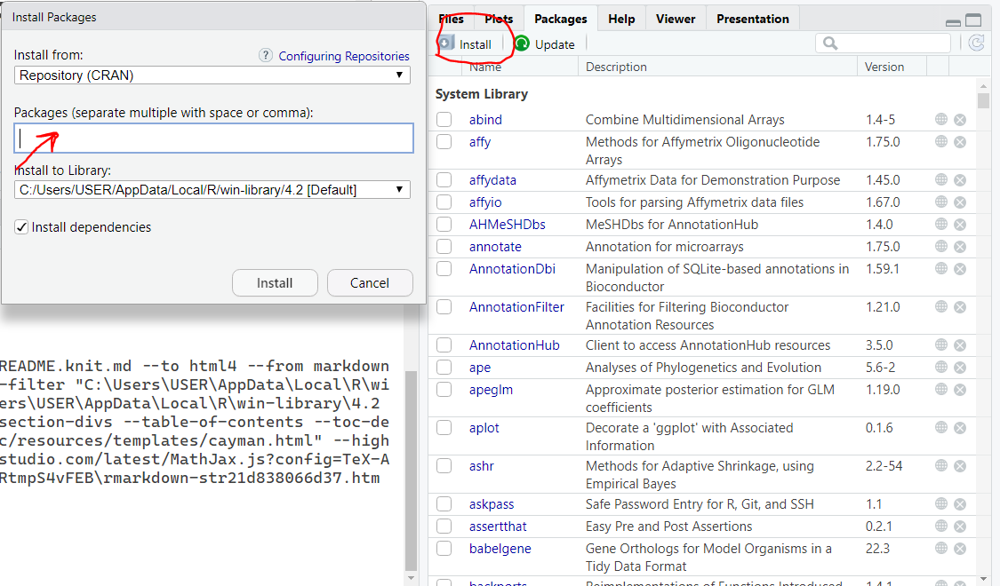

```{r setup, include=FALSE}
knitr::opts_chunk$set(echo = TRUE)
```

# Introduction

Welcome to the R workshop! Below you'll find prerequisites for the classes. This file and the repository will be updated before each session. The workshop will be a code-along, and in-person workshop and you do not need any prior knowledge of R. After each session, please fill out the [feedback form](https://forms.gle/yFGRZDyr3yxQQkgJ6).

# Session 1: Monday, 08/29/2022, Room 3113, 11 AM - 1 PM

## Title

Introduction to R

## Learning objectives 

-   What is R and R Studio

-    Variables and missing values

-   Operators

-   Functions

-   Conditional statements

-   Data structures

-   Read and write files

-   Data wrangling

## Prerequisites

1.  Install R-4.2.1:

    You can download R from these links:

    [Download R-4.2.1 for Windows](https://cran.r-project.org/bin/windows/base/)

    [Download R-4.2.1 for Mac OS](https://cran.r-project.org/bin/macosx/)

2.  Install RStudio 2022.07.1:

    You can download RStudio from this link:

    [Download RStudio 2022.07.1](https://www.rstudio.com/products/rstudio/download/#download)

3.  Install "tidyverse", "readr", and "dplyr" packages:

    Open RStudio and click on the Packages tab in the panel. You can install them by writing their names in the new window.

    

# Session 2: Tuesday, 08/30/2022, Room 3113, 1 - 3 PM

Title: Bulk RNA-seq Data Analysis with the DESeq2 Package

# Session 3: Wednesday, 08/31/2022, Room 2108, 1 - 3 PM 

## Title

Pathway Analysis in R
