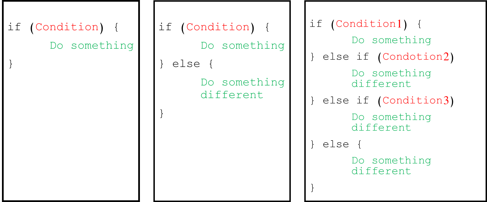

```{r setup, include=FALSE}
knitr::opts_chunk$set(echo = TRUE)
```

# Introduction to the workshop

# What is programming?

Programming is giving a set of instructions to a computer to perform tasks. Programming can be done using a variety of computer programming languages. Programming languages are the tools that we use to write the instructions for computers. Computers only understand 1s and 0s. 0s mean no flow of electricity, and 1s represent electricity is allowed to flow. Programming languages allow us to translate 1s and 0s into something that humans can understand.

[{width="595"}](https://www.codecademy.com/resources/blog/programming-languages/)

# R as a programming language

R is both software and language. R is a system for statistical analyses and graphics. At first, R could seem too complex for a non-specialist. This may not be true. R's syntax is very simple.

[](https://timmastny.com/projects/r-syntax-highlighting-gallery/)

# First line of code

Open your R console. It should be look like this:


Write: `print("Hello, World!")`Then, press enter.

```{r, include=TRUE, echo=TRUE}
print("Hello, World!")
```


You can see the phrase is presented on your screen. When that little angle bracket is there, it means there is no work in progress and you can run a new instruction. But if you couldn't see the angle bracket, it means some instructions are running and you need to wait.

The phrase "Hello, World!" is a small test which existed since the development of programmable computers. It is a tradition to use this phrase as a test message.

# Comments

Comments are used to document and explain the code. They are ignored when the program is running.

A comment can be created using \# (hash sign or number sign) in R.

```{r, include=TRUE, echo=TRUE}
# This is a comment!
# outputs "Hello, World!"
print("Hello, World!")
```

# Variables

Every R program deals with data. Variables allow us to store and manipulate data. They have a name and a value and they are binding with an assignment operator.

{width="472"}

We will discuss five main types of variables in R.

You can show type of a data with `typeof()` function. Also, `class()` show you the class an object belong to.

## Type of variables

### numeric

It represents all real numbers with or without decimal values.

```{r, include=TRUE, echo=TRUE}
num_var <- 1234
print(num_var)
typeof(num_var)
class(num_var)
```

#### integer

It specifies real values without decimal points. You can define it with a L at the end of the number.

```{r, include=TRUE, echo=TRUE}
int_var <- 11L
print(int_var)
typeof(int_var)
class(int_var)
```

#### complex

It is used to specify purely imaginary values.

```{r, include=TRUE, echo=TRUE}
comp_var <- 2-6i
print(comp_var)
typeof(comp_var)
class(comp_var)
```

#### character

It is used to specify character or string values in a variable. You can define it by writing a text in a couple of signle or double quotations. A string is a set of characters. For example, "A" is a character but "Hello1234!" is a string.

```{r, include=TRUE, echo=TRUE}
char_var <- "Hello, World!"
print(char_var)
typeof(char_var)
class(char_var)
```

#### logical

They are binary values, which can be True or False.

```{r, include=TRUE, echo=TRUE}
log_var <- TRUE
print(log_var)
typeof(log_var)
class(log_var)
log_var <- FALSE
log_var <- T
log_var <- F
```

## Converting between variables

Converting between data types in R is possible with these functions.


```{r, include=TRUE, echo=TRUE}
var <- 22.84
as.integer(var)
as.complex(var)
as.character(var)
```

# Missing data and NULL object

-   The NA symbol represents missing values. (not available)

-   The NaN symbol represents impossible values. (for example, dividing by zero) (not a number)

-   NULL object in R is used to represent the undefined values.

    (We will discuss them more.)

# Operators

An operator is a symbol that tells the computer to perform specific actions. There are three main types of operators in R.


```{r, include=TRUE, echo=TRUE}
a <- -3; b <- 10
#arithmatic
a + b
b %% 3
#comparison
a > b
a == b
a != b
#logical
(a == b) & (a == -3)
(a == b) | (a == -3) 
```

# Functions

Functions are a piece of code that accomplish a specific task. Functions usually take in some data, process it, and return a result. Functions are always recognizable with the pair of parenthesis.


As an example, `as.integer()` is a function. Its argument is a numeric variable and it returns an integer value. It is recognizable by its parenthesis.


Some functions are in-built in R or they are provided by the packages. (Packages are the collection of R functions.) Also, you can write your own function. We will discuss it later.

# Conditional statements

Imagine you have a list of numbers and you need to separate odd numbers from this list. We know that there is always a remainder when an odd number is divided by 2 and it is not equal to zero. If you want to check the list, you can tell the computer, check if the remainder of the number nth in the list is not equal to zero. If it is, pick the nth number in the list. This phrase is a condition that computer need to check it. Conditional statements are the way computers can make decisions. Conditional statements always have an if part and if you need more conditions to make up your decisions, else part can be helpful.



The below code, shows how to pick odd numbers from the list of numbers. We've already learned it the remainder operator `%%` and we know the conditional operates like`==, !=, \<, \>\`.

```{r, include=TRUE, echo=TRUE}
var <- 11
if (var %% 2 != 0) {
  print("the number is odd.")
}

if (var %% 2 == 0) {
  print("the number is even.")
} else {
  print("the number is not even")
}

if (var %% 2 == 0) {
  print("the number is even.")
} else if (var %% 11 == 0) {
  print("the number is the multiple of 11")} else {
    print("the number is odd.")
  }

```

# Loop

In computer programming, a loop is a sequence of instructions that continually repeats until a certain condition is reached. For example you want to print stars with a specific pattern. You have 5 lines. Line n should have n stars, first line one star, second line two stars and so on. You can make this output with a loop. There are two types of loops.


```{r, include=TRUE, echo=TRUE}
n <- c(1:5) #n = (1, 2, 3, 4, 5) - n is a sequence
for (i in n) {
  print(rep("*", i)) #The `rep(value, x)` function replicates the values in x.
}

i <- 1
while (i <= 5) {
  print(rep("*", i))
  i <- i + 1
}
```

# STOP_1
## Algorit