```{r setup, include=FALSE}
knitr::opts_chunk$set(echo = TRUE)
```

# Introduction to the Workshop

This workshop is for biologists interested in learning how to work with R to analyse their bulk RNA-seq data and perform pathway analysis. This will be a code-along, in-person workshop.

# What is Programming?

Programming is giving a set of instructions to a computer to perform tasks. Programming can be done using a variety of computer programming languages. Programming languages are the tools we use to write computer instructions. Computers only understand 1s and 0s. 0s mean no flow of electricity, and 1s represent electricity is allowed to flow. Programming languages allow us to translate 1s and 0s into something humans can understand.

[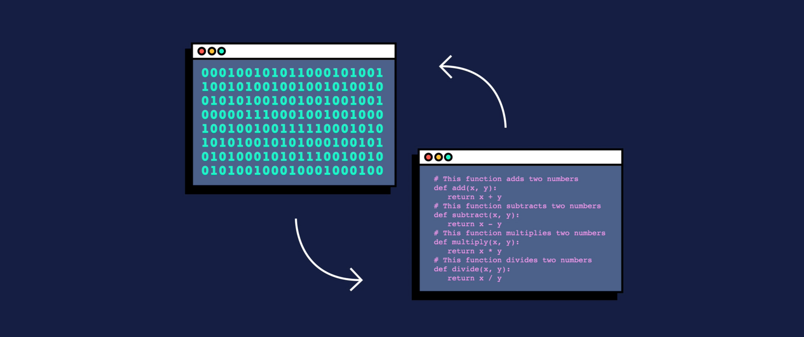{width="595"}](https://www.codecademy.com/resources/blog/programming-languages/)

# R as a Programming Language

R is both software and language. R is a system for statistical analyses and graphics. At first, R could seem too complex for a non-specialist. This may not be true. R's syntax is straightforward.

[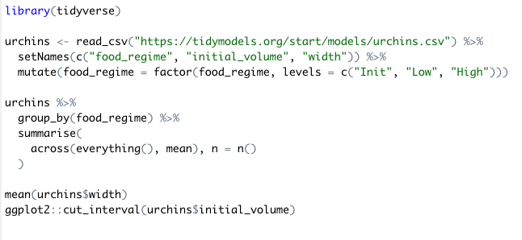](https://timmastny.com/projects/r-syntax-highlighting-gallery/)

# RStudio

RStudio is an IDE (integrated development environment) used to manage and execute R code.

[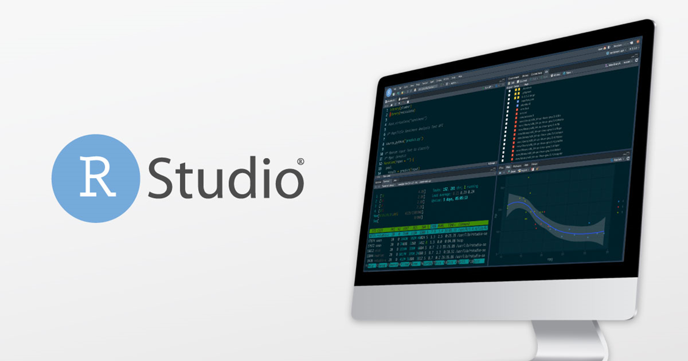{width="663"}](https://www.rstudio.com/products/rstudio/)

# First Line of Code

Open RStudio and make an R script file.

Write: `print("Hello, World!")`Then, press ctrl + enter.

```{r, include=TRUE, echo=TRUE}
print("Hello, World!")
```

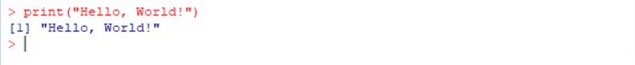

You can see the phrase is presented on your console. When that little angle bracket is represented, it means there is no work in progress, and you can run a new instruction. But if you can't see the angle bracket, it means some instructions are running, and you need to wait.

The phrase "Hello, World!" is a small test which existed since the development of programmable computers. It is a tradition to use this phrase as a test message.

# Comments

Comments are used to document and explain the code. They are ignored when the program is running.

A comment can be created using \# (hash sign or number sign) in R.

```{r, include=TRUE, echo=TRUE}
# This is a comment!
# outputs "Hello, World!"
print("Hello, World!")
```

# Variables

Every R program deals with data. Variables allow us to store and manipulate data. They have a name and value and are bound by an assignment operator.

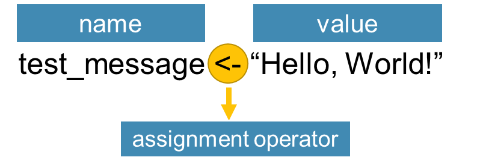

We will discuss five main types of variables in R.

You can show the data type with the `typeof()` function. Also, `class()` show you the class an object belongs to.

## Type of variables

### numeric

It represents all real numbers with or without decimal values.

```{r, include=TRUE, echo=TRUE}
num_var <- 1234
print(num_var)
typeof(num_var)
class(num_var)
```

#### integer

It specifies real values without decimal points. You can define it with an L at the end of the number.

```{r, include=TRUE, echo=TRUE}
int_var <- 11L
print(int_var)
typeof(int_var)
class(int_var)
```

#### complex

It is used to specify purely imaginary values.

```{r, include=TRUE, echo=TRUE}
comp_var <- 2-6i
print(comp_var)
typeof(comp_var)
class(comp_var)
```

#### character

It is used to specify character or string values in a variable. You can define it by writing a text in a couple of single or double quotations. A string is a set of characters. For example, "A" is a character but "Hello1234!" is a string.

```{r, include=TRUE, echo=TRUE}
char_var <- "Hello, World!"
print(char_var)
typeof(char_var)
class(char_var)
```

#### logical

They are binary values, which can be True or False.

```{r, include=TRUE, echo=TRUE}
log_var <- TRUE
print(log_var)
typeof(log_var)
class(log_var)
log_var <- FALSE
log_var <- T
log_var <- F
```

## Converting Between Variables

Converting between data types in R is possible with these functions.


```{r, include=TRUE, echo=TRUE}
var <- 22.84
as.integer(var)
as.complex(var)
as.character(var)
```

# Missing data and NULL object

-   The NA symbol represents missing values. (not available)

-   The NaN symbol represents impossible values. (for example, dividing by zero) (not a number)

-   NULL object in R is used to represent the undefined values.

    (We will discuss them more.)

# Operators

An operator is a symbol that tells the computer to perform specific actions. There are three main types of operators in R.

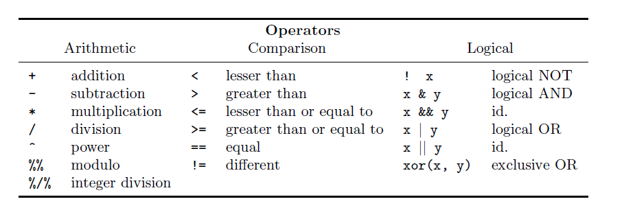

```{r, include=TRUE, echo=TRUE}
a <- -3; b <- 10
# arithmatic
a + b
b %% 3
# comparison
a > b
a == b
a != b
# logical
(a == b) & (a == -3)
(a == b) | (a == -3) 
```

# Functions

Functions are a piece of code that accomplish a specific task. Functions usually take in some data, process it, and return a result. Functions are always recognisable with a pair of parenthesis.

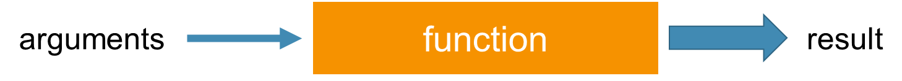

As an example, `as.integer()` is a function. Its argument is a numeric variable, and it returns an integer value. It is recognisable by its parenthesis.

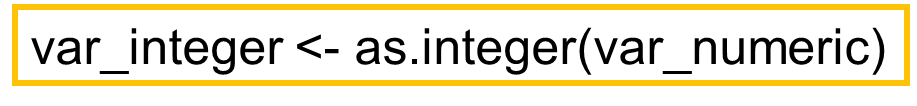

Some functions are in-built in R or provided by the packages. (Packages are the collection of R functions.) Also, you can write your own function. We will discuss it later.

Here is a list of maths functions of base R. You can find helpful functions from base R in the book of *R for Beginners* by Emmanuel Paradis on pages 36 and 37.

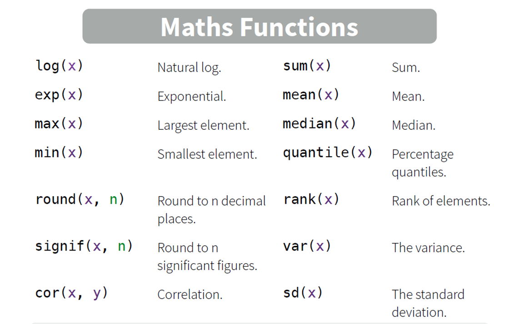

# Conditional Statements

Imagine you have a list of numbers and need to separate odd numbers from this list. We know that there is always a remainder when an odd number is divided by 2, which is not equal to zero. If you want to check the list, you can tell the computer to check if the remainder of the number nth in the list is not equal to zero. If it is, pick the nth number in the list. This phrase is a condition that the computer needs to check it. Conditional statements are the way computers can make decisions. Conditional statements always have an if part, and if you need more conditions to make up your decisions, the else part can be helpful.

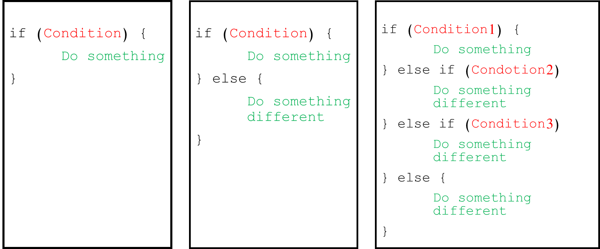

The below code shows how to pick odd numbers from the list of numbers. We've already learned the remainder operator `%%`, and we know the conditional operates like`==, !=, \<, \>\`.

```{r, include=TRUE, echo=TRUE}
var <- 11
if (var %% 2 != 0) {
  print("the number is odd.")
}

if (var %% 2 == 0) {
  print("the number is even.")
} else {
  print("the number is not even")
}

if (var %% 2 == 0) {
  print("the number is even.")
} else if (var %% 11 == 0) {
  print("the number is the multiple of 11")} else {
    print("the number is odd.")
  }

```

# Loops

In computer programming, a loop is a sequence of instructions that continually repeats until a certain condition is reached. For example, you want to print stars with a specific pattern. You have five lines. Line n should have n stars, first line one star, second line two stars and so on. You can make this output with a loop. There are two types of loops.

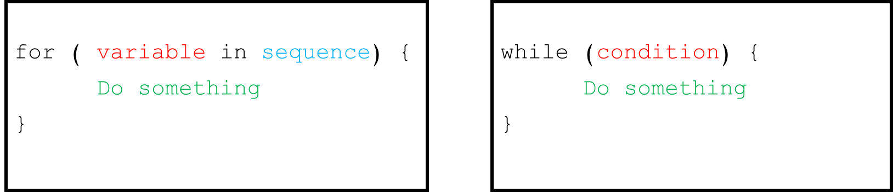

```{r, include=TRUE, echo=TRUE}
n <- c(1:5) #n = (1, 2, 3, 4, 5) - n is a sequence
for (i in n) {
  print(rep("*", i)) #The `rep(value, x)` function replicates the values in x.
}

i <- 1
while (i <= 5) {
  print(rep("*", i))
  i <- i + 1
}
```

# Data Structures

Data structures are methods of storing and organising data in a computer system.

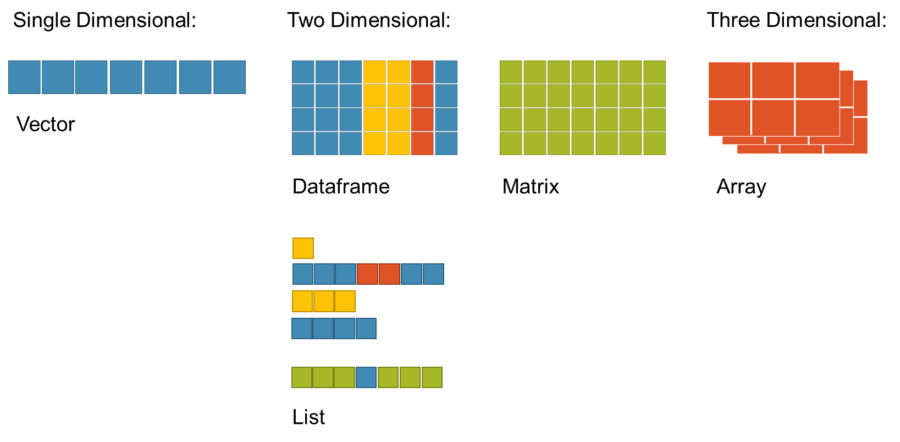

## Vectors

A vector is just a set of objects of the same type.

### Creating

A vector can be created using the c(). There are different ways to create a vector. The below tables show them.

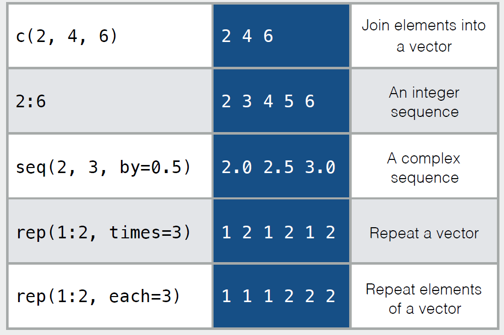

```{r}
# join elements to a vector
names_vec <- c("Sarah", "Maria", "Alex")
names_vec

# create an integer sequence
int_vec <- c(1:10)
int_vec

# create a sequence of decimal numbers
dec_vec <- seq(from = 0, to = 2, by = 0.5)
dec_vec

# create a vector with repeating elements
## repeats the whole x, n times
rep_t_vec <- rep(x = c(1:2), times = 3)
rep_t_vec

## repeats each element in x, n times
rep_e_vec <- rep(x = c(1:2), each = 3)
rep_e_vec
```

**Q:** Is it possible to store different types of variables in a vector?

It is possible, but the variables' types change after creating the vector.

```{r}
# you can see the elements' types are changed to the character, and when we want to show them, you can see the quotation in their representation.
names_vec_2 <- c("Sarah", 2, TRUE)
class(names_vec_2[2])
names_vec_2[2]
class(names_vec_2[3])
names_vec_2[3]

# you can see the elements' types are changed to numeric.
## logical values as numeric values: TRUE -> 1, FALSE -> 0
names_vec_3 <- c(TRUE, 2)
class(names_vec_3[1])
names_vec_3[1]
class(names_vec_3[2])
names_vec_3[2]
```

### Naming

You can name vector elements.

```{r, echo=TRUE}
vec <- c(first = 10, second = 20, third = 30)
vec
```

If you already have a vector, there are two functions to use.

```{r, echo=TRUE}
new_vec <- c(10, 20, 30)
new_vec <- setNames(vec, c("I", "am", "happy"))
new_vec
names(new_vec) <- c("sarah", "maria", "alex")
new_vec
```

### Selecting Elements

You can select elements of a vector by position and value. We call the position of the index of the element.

|                                                              |                                                              |
|--------------------------------------------------------------|--------------------------------------------------------------|
| 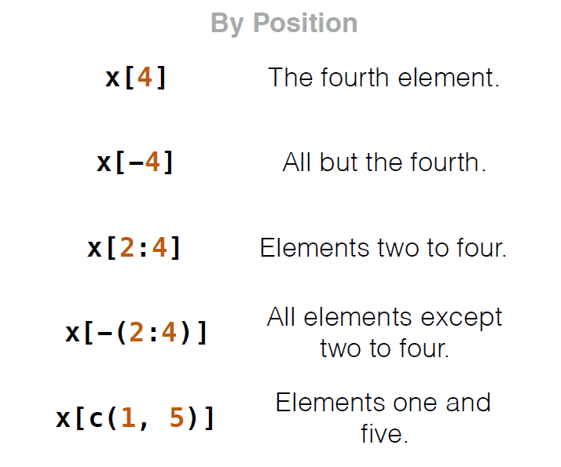{width="360"} | {width="358"} |

```{r}
heroes_vec <- c("spiderman", "batman", "joker", "thor", "ironman")
heroes_vec

# by position
heroes_vec[2]
heroes_vec[-2]
heroes_vec[2:5]
heroes_vec[-(2:5)]
heroes_vec[c(1, 5)]

# by value
subset_vec <- c("joker", "ironman")
hero <- "batman"

heroes_vec[heroes_vec == hero] # you can put any other conditions here
heroes_vec[heroes_vec %in% subset_vec]

# named vector
names(heroes_vec) <- c("Marvel1", "Marvel2", "Marvel3", "Marvel4", "Marvel5")
heroes_vec['Marvel3']
```

### Order

You can order a vector with two functions. By default, these functions order a vector in ascending order.

Syntax: sort(x, decreasing)

```{r, echo=TRUE}
n <- c(12, 1, 133, -2)
n
n_sorted <- sort(n, decreasing = TRUE) #by setting the decreasing argument to TRUE, we can order the vector descending
n_sorted
```

Syntax: order(x)

```{r, echo=TRUE}
order(-n) #order() returns the ordered elements
n_ordered <- n[order(-n)] #by putting a minus before the argument, we can order the vector descending
n_ordered
```

### Combine Vectors

You can add a vector to others with c(). You can use it to add a new element, too.

```{r, echo = TRUE}
# add a vector to another
x <- c("x1", "x2")
y <- c("y1", "y2")
combined_vec <- c(x, y) # the order of vectors in c function is important
combined_vec
combined_vec <- c(y, x)
combined_vec

# add a new element to a vector
x <- c(x, "hi!")
x
```

### Length

You can show the length of a vector by length().

Syntax: length(x)

```{r}
vec <- (1:10)
vec
length(vec)
```

## Factors

[{width="479"}](https://r-coder.com/factor-r/)

Factors are used to represent categorical data. They are kind of ordered labelled vectors. Factors are an important class for statistical analysis and helpful in plotting. The factor() allows us to create factors.

Syntax: factor(x, levels)

```{r}
#factor()
cities_vec <- c("Vancouver", "Burnaby", "Tehran", "Vancouver", "Tehran")
cities_fac <- factor(x = cities_vec)
cities_fac
cities_fac <- factor(x = cities_vec, levels = sort(unique(cities_vec))) 
cities_fac
# unique() returns a vector/data frame with duplicate elements/rows removed
# we know sort() from the last part. When you sort a vector of characters, it will sort it alphabetically.
```

The factor is a type of data.

```{r}
class(cities_fac)
```

You can relevel your factor object or display it by levels(). Syntax: levels(x)

```{r}
l_vec <- levels(cities_fac)
l_vec
levels(cities_fac) <- rev(l_vec) # rev() reverses a vector
cities_fac
```

## Data Frames

A data frame is the most common way of sorting data in R. It is a list of equal-length vectors. It is table shaped and has columns and rows.

Column names should not be empty in a data frame. Row names should be unique.

### Creating

You can create a data frame with data.frame()

Syntax: data.frame(vec1, vec2, vec3, ...)

```{r}
# creating a data frame
heroes_df <- data.frame(name = c("ironman", "spiderman", "batman"),
                 strength_score = c(10, 8, 8.2))
print(heroes_df)

# you can add row names when you are creating the data frame by adding a row.names argument
heroes_df <- data.frame(name = c("ironman", "spiderman", "batman"),
                 strength_score = c(10, 8, 8.2),
                 row.names = c("hero_1", "hero_2", "hero_3"))
print(heroes_df)

# we can add a new column with the $ operator.
heroes_df$assigned_color <- c("red", "red&blue", "black")
heroes_df
```

### Subsetting

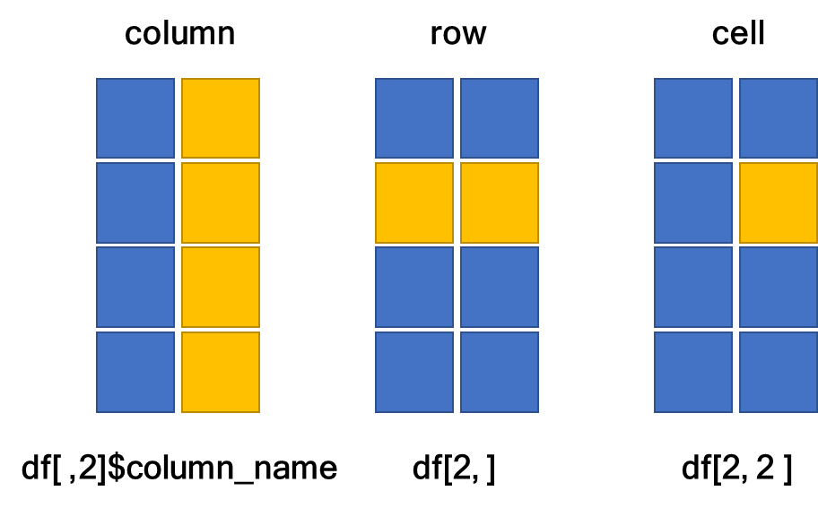

When we don't specify the row index or column index, we select all of them.

```{r}
# column
heroes_df[, 1]
heroes_df$strength_score

# row
heroes_df[2, ]

# a cell
heroes_df[1, 2]
```

### Functions

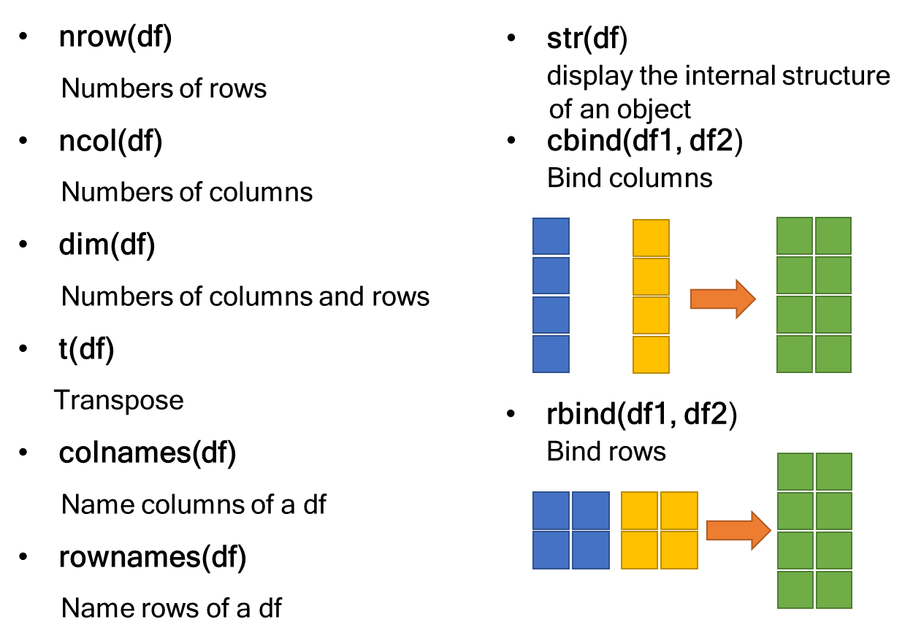

```{r}
# R has some in-built data sets. You can load them by data("name of data set")
data("mtcars")

# display the internal structure
str(mtcars)
## it shows that there are 11 columns with 32 elements in each column.
## All of the values in the columns are numeric. The mtcars is a data frame.

# column names and row names
col_names <- colnames(mtcars)
col_names
## toupper() is a function to capitalise all of the letters in a string
new_col_names <- toupper(col_names)
colnames(mtcars) <- new_col_names
colnames(mtcars)

rownames(mtcars)

# number of columns and rows
nrow(mtcars)
ncol(mtcars)
dim(mtcars)

# transpose
t_df <- t(mtcars)
head(t_df)

# binding
## cbind
car_1_df <- mtcars[, c(1:5)]
head(car_1_df) # head() shows the first 5 rows
car_2_df <- mtcars[, c(6:ncol(mtcars))]
head(car_2_df)
# the place of arguments is important.
head(cbind(car_1_df, car_2_df)) # here I am using the output of cbind() as the input of head()
head(cbind(car_2_df, car_1_df))

## rbind
car_1_df <- mtcars[1:10, ]
head(car_1_df)
car_2_df <- mtcars[11:nrow(mtcars), ]
head(car_2_df)
# the place of arguments is important.
head(rbind(car_1_df, car_2_df))
head(rbind(car_2_df, car_1_df))

```

## Matrices

Matrix is a collection of elements of the same data type arranged into a fixed number of rows and columns. The length of columns should be equal.

### Creating

You can create a matrix with matrix().

Syntax: matrix(x, nrow, ncol, byrow) The nrow and ncol arguments determine the number of rows and columns. The byrow argument accepts logical values. If it sets to TRUE, the matrix is filled by columns, otherwise is filled by rows.

```{r}
vec <- c(1:10)
matrix(data = vec, nrow = 5, ncol = 2, byrow = FALSE)
matrix(data = vec, nrow = 5, ncol = 2, byrow = TRUE)
```

The mentioned functions in the data frame part can be used for matrices.

## Lists

Lists are ordered collections of any R object. It stores different types of elements. Collections can have different lengths despite matrices and data frames.

### Creating

You can create a list with the list(). Syntax: list(object1, object2, object3, ...)

```{r}
vec <- c(1:10)
mat <- matrix(vec, nrow = 5, ncol = 2)
fac <- factor(c("blue", "red", "blue", "yellow"))
l <- list(numbers_vec = vec, numbers_mat = mat, colors = fac)
l
```

### Selecting Elements

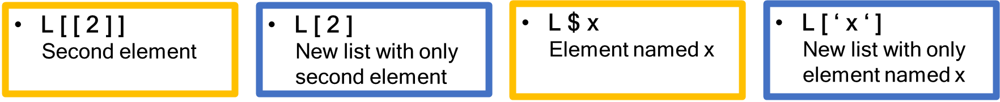

```{r}
l[[2]]
l[2]
l$colors
l['colors']
```

## Converting

You can convert data structures to each other by functions.

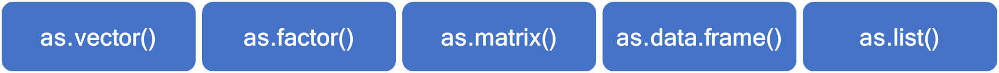

```{r}
df <- data.frame(col_1 = c(1:3),
                 col_2 = c(4:6))
df
mat <- as.matrix(df)
mat
l <- as.list(mat)
l
vec_mat <- as.vector(mat)
vec_mat
fac <- as.factor(vec_mat)
fac
df <- as.data.frame(l)
df
```

**Q_1:** When we convert a data frame or a matrix to a list, we miss the column names. Is it possible to assign the column names to the list elements?

Yes, you can use the names().

```{r}
names(l) <- colnames(mat)
l
```

However, you cannot assign the column names directly. It cannot recognise the elements of each column. So we need to define the names by ourselves.

```{r}
names(l) <- rep(colnames(mat), each = 3)
l
```

**Q_2:** Is it possible to convert any type of object to another?

No, sometimes converting two-dimensional data structures to single-dimensional data structures is impossible. For example, you cannot convert a data frame or a list to a vector.

```{r}
vec_df <- as.vector(df)
vec_df
vec_l <- as.vector(l)
vec_l
```

# Defining a Function

You can write your own functions to make repetitive operations using a single command. Your function can return nothing and should be defined before using.

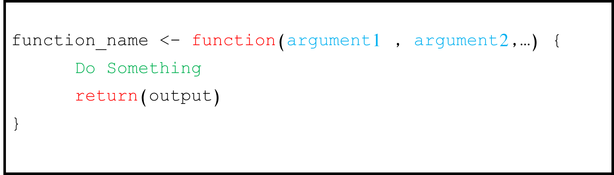

```{r}
# I want to write a function to add two numbers and check if their addition is more than 10. I want to get "Yes!" if it was, otherwise see a "No!" on my screen
check_more_than_10 <- function(num1, num2){
  if (num1 + num2 > 10){
    return("Yes!")
  } else {
    return("No!")
  } 
}

result <- check_more_than_10(1, 4)
result
```

# Naming Objects and Functions

-   Object names must start with a letter, and can only contain letters, numbers, underscore (\_), and dot (.).

-   The name of an object should be meaningful and show its purpose clearly.

-   There are different styles of naming objects, but it is recommended to use the snake_case style. In this style, each space is replaced by an underscore character, and the first letter of each word is written in lowercase.

-   There are other ways to name objects.

    someUseUpperLettersToSeparateWords

    some.use.dots

Here are some tips for naming objects:

-   Show what type of data structure your object is. For example, `cars_df` shows this object is a data frame.

-   Start the name of logical variables with "is". For example, `is_odd = TRUE`.

-   Sometimes, you have to use a string or a number several times. For instance, you have a not ordered vector of numbers. You want to select numbers more than 10, but you are unsure if you want to change them later, and you used this condition many times in your code. It is better to define this value as a variable. Because if you decide to change the value, you don't need to change it one by one. You will change the value. It is better to name it will all uppercase letters. Like `SELECTED_NUMS = 10`.

-   Names should be meaningful, but you should not name them long. For instance, besides naming this: `up_regulated_genes_from_gsea_method_and_mesh_database_list`

    Use this: `up_gsea_mesh_l`

-   Start function names with command verbs to separate them from other objects and variables.

-   There are some reserved names in R. We call them keywords. For example, data.frame is a key word. You cannot name your objects similar to a reserved name. Because they will be overwritten and you will miss them.

-   Have your own style in naming!

# Libraries and Packages


In R, a package is a collection of R functions and data. Packages are stored in libraries.

The tidyverse package is a collection of R packages designed for data science.

[{width="604"}](https://www.tidyverse.org/)

With library(), we can load the packages into the session and make their functions available.

```{r}
# install.packages("tidyverse)
library(tidyverse)
```

You can see some packages are loaded. But the loading message is followed by a message that some functions are masked. Because some of the functions have the same name in different packages. For example, both stats and dplyr have a function called filter. To determine which package you want to use, you can write it in this format: `dplyr::filter().`

CRAN is a network of web servers around the world that store identical versions of code and documentation for R. You can install packages from CRAN by running `install.packages("package_name")`. However, you can install a CRAN package from the right panel of RStudio.

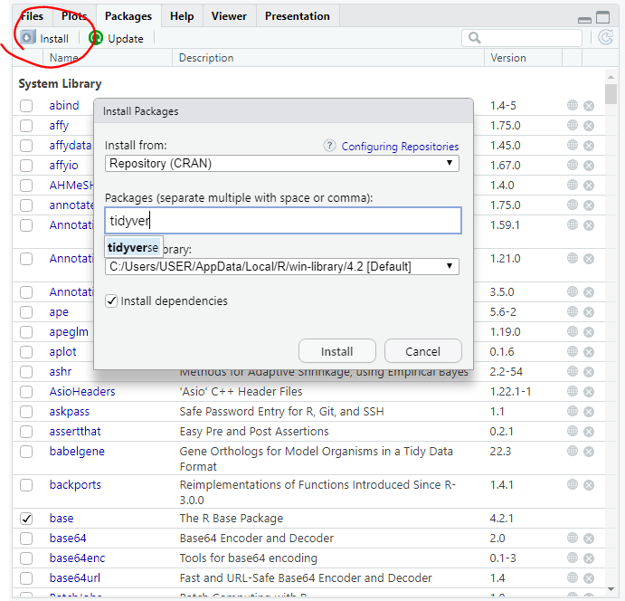{width="564"}

There are other ways to install a package. You can install it from GitHub or a .zip file on your computer.

You can install that package with this command:

`install.packages("file_path\\package_file_name.extension",  repos = NULL, type = "source")`

Or, in the previous window, change the "install from" to Package Archive File.

You can install a package from GitHub. First, you need to install the devtools package.

`install.packages(devtools)`

Then you can use this command:

`devtools::install_github(account_name/repository_name)`

# Data Wrangling

Data wrangling - data cleaning - refers to various processes designed to transform raw data.

There are three main parts to data wrangling:

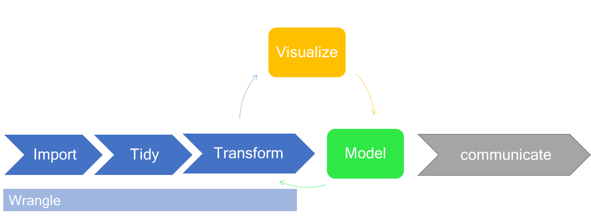

## Importing Data

We use the readr package to import data. There are four types of files.

-   delimited file: A delimited file is a sequential file with column delimiters.

-   CSV file: A CSV (comma-separated values) file is a text file in which commas or semicolons separate information.

-   TSV file: A TSV file is a tab-separated values file for storing data in a tabular structure.

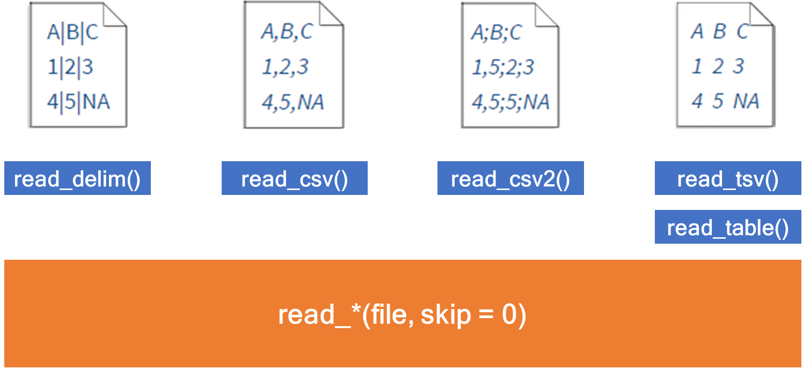

You can read files from excel with functions from readxl package. `my_data <- readxl::read_excel("my_file.xls")` You can specify a sheet by its name or index. `my_data <- read_excel("my_file.xlsx", sheet = 2)` `my_data <- read_excel("my_file.xlsx", sheet = "name_of_sheet")`

## Tidy Data

Tidy data is a consistent way of storing data that makes the next steps easier. There are three rules which make a dataset tidy:

1.  Each variable must have its own column.

2.  Each observation must have its own row.

3.  Each value must have its own cell.

[{width="457"}](https://r4ds.had.co.nz/tidy-data.html#tidy-data-1)

We have a file in the "Sessions/1/data/" containing tidy data from some women about their living place, height and weight.

```{r, include=FALSE, echo=FALSE}
# MAKING THE DATA
data("women")
women$name <- c("Olivia", "Emma", "Charlotte", "Amelia", "Ava", "Sophia", "Isabella", "Mia", "Evelyn", "Harper", "Luna", "Camila", "Gianna", "Elizabeth", "Eleanor")
women$city_province <- c(rep("Vancouver, BC", 5), rep("Edmonton, AB", 3), rep("Toronto, ON", 4), rep("Ottawa, ON", 3))
colnames(women)[c(1, 2)] <- c("weight_kg", "height_cm")
women <- dplyr::select(women, name, city_province, weight_kg, height_cm)
women[c(4, 5, 6, 7), 3] <- women[c(4, 5, 6, 7), 3] - 30
women[c(1, 2, 9), 3] <- women[c(1, 2, 9), 3] - 40
# dup_women <- women[c(1, 5, 7), ]
# dup_women[, 3] <- dup_women[, 3] + 15
# women <- rbind(women, dup_women)
women[c(3, 5, 8), 4] <- NA
write_csv(women, file = "data/women.csv")
```

```{r}
women <- readr::read_csv("data/women.csv")
```

```{r, include=FALSE, echo=TRUE}
women
```

## Transformation

We will learn some functions that help transform our data.

### mutate()

The mutate() adds new variables and preserves existing ones. Syntax: mutate(data.frame, new_column_1 = calculation_1, new_column_2 = calculation_2, ...)

```{r}
women <- mutate(women, height_inch = height_cm / 2.54)
women

# mutate and add the new column as the last column. You can change the place by .before or .after arguments.
women <- mutate(women, weight_lbs = weight_kg / 2.2, .after = weight_kg)
women
```

### ifelse()

The ifelse() is a shorthand vectorised alternative to the standard if...else statement. Syntax: ifelse(test_expression, x, y)

```{r}
num_vec <- c(1:10)
result <- ifelse( num_vec %% 2 == 0, "even", "odd" )
names(result) <- c(1:10)
result
```

You can use it with mutate().

```{r}
women <- mutate(women, is_bmi_normal = ifelse(((18.5 <= weight_lbs/(height_inch ^ 2))
                                               & (weight_lbs/(height_inch ^ 2) <= 24.9)), "normal", "not normal"))
```

### case_when()

The case_when() is an alternative to an ifelse(). You can use multiple if else statements whenever you need to use them. Syntax: case_when(conditional_statement1 \~ x, conditional_statement2 \~ y, ...)

```{r}
num_vec <- c(0:10)

result <- case_when(num_vec == 0 ~ "zero",
                    num_vec %% 2 == 0 ~ "even",
                    TRUE ~ "odd") # TRUE means if not all above conditions are equal to TRUE, so set "odd" as the value
names(result) <- c(0:10)
result
```

You can use it with mutate().

```{r}
women <- mutate(women, bmi = case_when(weight_kg/height_cm/height_cm*10000 >= 30 ~ "obesity",
                                      weight_kg/height_cm/height_cm*10000 >= 25 &
                                      weight_kg/height_cm/height_cm*10000 < 30 ~ "overweight",
                                      weight_kg/height_cm/height_cm*10000 < 25 &
                                      weight_kg/height_cm/height_cm*10000 >= 18.5 ~ "normal",
                                      weight_kg/height_cm/height_cm*10000 < 18.5 ~ "underweight"
                                      )
                )
women
```

### group_by()

You can use group_by() if you want to perform functions separately on different data splits. Syntax: group_by(data, column1, column2, ....)

```{r}
women_g <- group_by(women, bmi)
women_g <- mutate(women_g, weight_kg_mean = mean(weight_kg), .after = weight_kg)
women_not_g <- mutate(women, weight_kg_mean = mean(weight_kg), .after = weight_kg)
women_g
women_not_g
```

**Q1:** Why are the results different? Because calculating the mean in grouped data frame equals to mean in each group, but in ungrouped data.frame equals to mean of all weights.

You can ungroup data with `ungroup(data)`.

```{r}
women <- ungroup(women_g)
```

**Q2:** Is it possible to group data based on different variables? It is not possible with group_by(). You can add a new column that shows the results of performed conditions and use that for group_by().

```{r, include=FALSE, echo=FALSE}
# mean_height <- mean(women$height_cm, na.rm	= TRUE)
# women_h_g <-
#   women %>%
#   mutate(height = ifelse(height_cm > mean_height, "taller then mean", "shorter than mean")) %>%
#   group_by(bmi) %>%
#   group_by(height) %>%
#   mutate(mean_height = mean(height_cm, na.rm = TRUE))
# women_h_g
```

### subset()

The subset() returns a subset of the object which meets conditions.

Syntax: subset (x, subset_sondition)

```{r}
women_tall <- subset(women, bmi == "normal")
women_tall

women_na <- subset(women, is.na(height_cm)) # is.na() returns a logical value that determines if the variable in NA
women_na
```

### distinct()

The distinct selects only unique rows from a data frame. It picks the first represented duplicate row.

Syntax: distinct(df, column1, column2, ..., .keep_all) Always set .keep_all to TRUE.

```{r, include = FALSE, echo = FALSE}
dup_women <- data.frame(name = women_tall[, 1],
                        city_province = women_tall[, 2],
                        weight_kg = c(50, 45, 40),
                        weight_kg_mean = c(NA, NA, NA),
                        weight_lbs = c(50/2.2, 45/2.2, 40/2.2),
                        height_cm = women_tall[, 6],
                        height_inch = women_tall[, 7],
                        is_bmi_normal = c(NA, NA, NA),
                        bmi = c(NA, NA, NA))
women <- rbind(women, dup_women)
```

Here is the new table. Three names are not unique.

```{r}
women
```

```{r}
women <- distinct(women, name, .keep_all = TRUE) # we determined that remove rows with duplicated names.
women
```

### select()

You can select columns from a data frame with select().

```{r}
women_name <- select(women, name) # separate a column
women_name
women_height <- select(women, starts_with("height")) # select columns that their names start with height
women_height                                         # you can use ends_with() to select your columns
women_weight <- select(women, contains("weight"))    # select columns that their names included weight
women_weight
```

### separate_rows()

"If a variable contains observations with multiple delimited values, this separates the values and places each in its own row." Here, the city_province column values are delimited by a comma.

Syntax: separate_rows(data, col, ..., sep, convert, remove) The convert should be a logical value. Always set it to TRUE.

```{r, include=FALSE}
women$city_province
```

```{r}
women_sep_row <- separate_rows(women, city_province, sep = ",", convert = TRUE)
```

### separate()

The separate() turns a single character column into multiple columns.

Syntax: separate(data, col, into, sep, convert). The convert should be a logical value. Always set it to TRUE.

```{r}
women_sep_col <- separate(data = women, col = city_province, into = c("city", "province"), sep = ",", convert = TRUE, remove = TRUE)
women_sep_col
```

### unite()

The unite() paste together multiple columns into one.

Syntax: unite(data, col, column1, column2, ..., sep, remove)

```{r}
women_united <- unite(data = women_sep_col, col = "city_province", city:province, sep = ",", remove = TRUE)
women_united
```

### na.omit()

The na.omit() returns the object with incomplete cases removed.

Syntax: na.omit(data)

```{r}
women_omit_na <- na.omit(women)
women_omit_na
```

### drop_na()

The drop_na() drops rows where any column we specified contains a missing value.

Syntax: drop_na(data, column1, column2, ...)

```{r}
women_drop_na <- drop_na(women, height_cm)
women_drop_na
```

### replace_na()

The replace_na() replaces NAs with specified values.

Syntax: replace(data, replace)

```{r}
# a vector
replacced_heights <- replace_na(women$height_cm,  replace = mean(women$height_cm, na.rm = TRUE))
replacced_heights

# a data frame
women_rep_na <- replace_na(women,  replace = list(height_cm = mean(women$height_cm, na.rm = TRUE)))
women_rep_na
```

### column_to_rownames()

The column_to_rownames() convert a column to rownames.

Syntax: column_to_rownames(data, var)

```{r}
women <- tibble::column_to_rownames(women, var = "name")
women
```

### rownames_to_column()

The rownames_to_column() convert rownames to a column.

Syntax: rownames_to_column(data, var)

```{r}
women <- tibble::rownames_to_column(women, var = "name")
```

## Strings

We will discuss some points and functions to work with strings in R.

### Functions

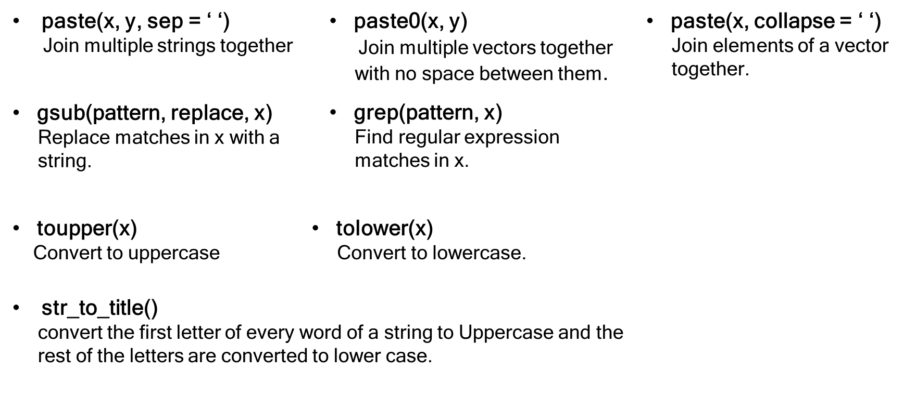

```{r}
str_1 <- "Hello_"
str_2 <- "World!"
vec <- c(str_1, str_2)
# paste
paste(str_1, str_2, sep = " ")
paste(vec, collapse = " ")
paste0(str_1, str_2)

# gsub
gsub("_", "!", str_1)
grep("Wo", vec)

# to
toupper(str_2)
tolower(str_1)

# str_to_title
str_to_title("r workshop")

```

### Special Characters

The "\\" is a special character in R. If you want to type a slash, you need to put another slash before it. Also, if you want a quotation in your string, you need to put a slash before it.

(Read the [stringr cheatsheet](https://github.com/rstudio/cheatsheets/blob/main/strings.pdf) second page for more information.)

```{r}
# print("\") ##You will get an error!
slash <- "\\"
slash
quote_str <- "\""
quote_str
```

# Acknowledgement

I would like to thank my supervisor Dr Gregor Reid, Dr Ali Farrokhi, and Tanmaya Atre, for their support and guidance. Also, I would like to thank Reid's lab members and all of the people who helped me to get through my project.

# Resources

-   programiz.com

-   sololearn.com

-   codeacademy.com

-   swcarpentry.github.io

-   geeksforgeeks.org

-   r-lang.com

-   statmethods.net

-   techtarget.com

-   hbs-rcs.github.io

-   datamentor.io

-   tutorialspoint.com

-   englelab.gatech.edu

-   sthda.com

-   bookdown.org

-   r4ds.had.co.nz
