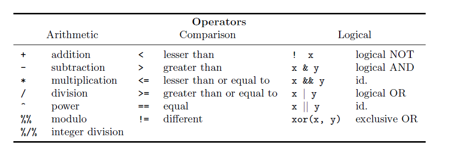
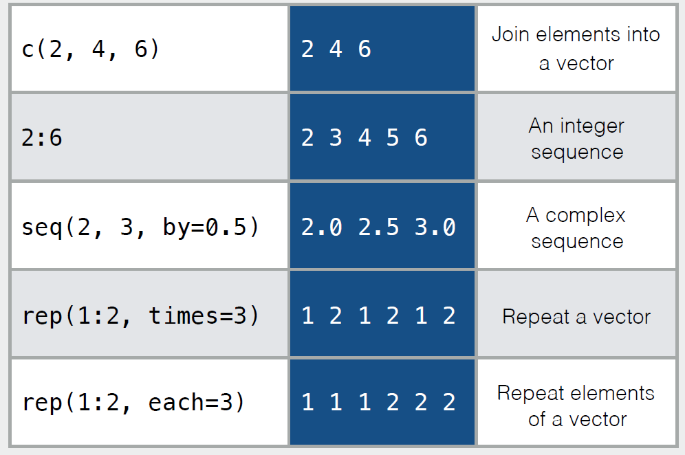
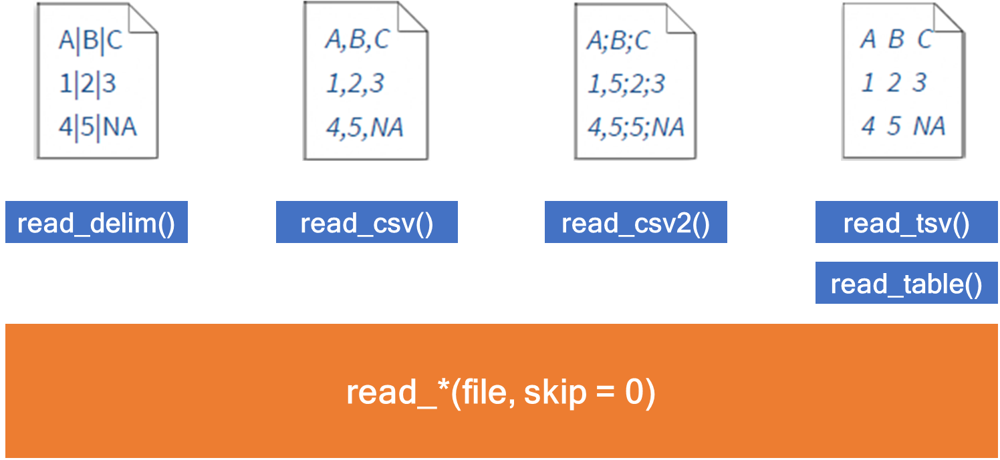

# Introduction to the Workshop

This workshop is for biologists interested in learning how to work with
R to analyse their bulk RNA-seq data and perform pathway analysis. This
will be a code-along, in-person workshop.

# What is Programming?

Programming is giving a set of instructions to a computer to perform
tasks. Programming can be done using a variety of computer programming
languages. Programming languages are the tools we use to write computer
instructions. Computers only understand 1s and 0s. 0s mean no flow of
electricity, and 1s represent electricity is allowed to flow.
Programming languages allow us to translate 1s and 0s into something
humans can understand.

# R as a Programming Language

R is both software and language. R is a system for statistical analyses
and graphics. At first, R could seem too complex for a non-specialist.
This may not be true. R’s syntax is straightforward.

# RStudio

RStudio is an IDE (integrated development environment) used to manage
and execute R code.

# First line of code

Open RStudio and make an R script file.

Write: `print("Hello, World!")`Then, press ctrl + enter.

    print("Hello, World!")

    ## [1] "Hello, World!"

You can see the phrase is presented on your console. When that little
angle bracket is represented, it means there is no work in progress, and
you can run a new instruction. But if you can’t see the angle bracket,
it means some instructions are running, and you need to wait.

The phrase “Hello, World!” is a small test which existed since the
development of programmable computers. It is a tradition to use this
phrase as a test message.

# Comments

Comments are used to document and explain the code. They are ignored
when the program is running.

A comment can be created using \# (hash sign or number sign) in R.

    # This is a comment!
    # outputs "Hello, World!"
    print("Hello, World!")

    ## [1] "Hello, World!"

# Variables

Every R program deals with data. Variables allow us to store and
manipulate data. They have a name and value and are bound by an
assignment operator.

We will discuss five main types of variables in R.

You can show the data type with the `typeof()` function. Also, `class()`
show you the class an object belongs to.

## Type of variables

### numeric

It represents all real numbers with or without decimal values.

    num_var <- 1234
    print(num_var)

    ## [1] 1234

    typeof(num_var)

    ## [1] "double"

    class(num_var)

    ## [1] "numeric"

#### integer

It specifies real values without decimal points. You can define it with
an L at the end of the number.

    int_var <- 11L
    print(int_var)

    ## [1] 11

    typeof(int_var)

    ## [1] "integer"

    class(int_var)

    ## [1] "integer"

#### complex

It is used to specify purely imaginary values.

    comp_var <- 2-6i
    print(comp_var)

    ## [1] 2-6i

    typeof(comp_var)

    ## [1] "complex"

    class(comp_var)

    ## [1] "complex"

#### character

It is used to specify character or string values in a variable. You can
define it by writing a text in a couple of single or double quotations.
A string is a set of characters. For example, “A” is a character but
“Hello1234!” is a string.

    char_var <- "Hello, World!"
    print(char_var)

    ## [1] "Hello, World!"

    typeof(char_var)

    ## [1] "character"

    class(char_var)

    ## [1] "character"

#### logical

They are binary values, which can be True or False.

    log_var <- TRUE
    print(log_var)

    ## [1] TRUE

    typeof(log_var)

    ## [1] "logical"

    class(log_var)

    ## [1] "logical"

    log_var <- FALSE
    log_var <- T
    log_var <- F

## Converting Between Variables

Converting between data types in R is possible with these functions.

    var <- 22.84
    as.integer(var)

    ## [1] 22

    as.complex(var)

    ## [1] 22.84+0i

    as.character(var)

    ## [1] "22.84"

# Missing data and NULL object

-   The NA symbol represents missing values. (not available)

-   The NaN symbol represents impossible values. (for example, dividing
    by zero) (not a number)

-   NULL object in R is used to represent the undefined values.

    (We will discuss them more.)

# Operators

An operator is a symbol that tells the computer to perform specific
actions. There are three main types of operators in R.

    a <- -3; b <- 10
    # arithmatic
    a + b

    ## [1] 7

    b %% 3

    ## [1] 1

    # comparison
    a > b

    ## [1] FALSE

    a == b

    ## [1] FALSE

    a != b

    ## [1] TRUE

    # logical
    (a == b) & (a == -3)

    ## [1] FALSE

    (a == b) | (a == -3) 

    ## [1] TRUE

# Functions

Functions are a piece of code that accomplish a specific task. Functions
usually take in some data, process it, and return a result. Functions
are always recognisable with a pair of parenthesis.

As an example, `as.integer()` is a function. Its argument is a numeric
variable, and it returns an integer value. It is recognisable by its
parenthesis.

Some functions are in-built in R or provided by the packages. (Packages
are the collection of R functions.) Also, you can write your own
function. We will discuss it later.

Here is a list of maths functions of base R. You can find helpful
functions from base R in the book of *R for Beginners* by Emmanuel
Paradis on pages 36 and 37.

# Conditional Statements

Imagine you have a list of numbers and need to separate odd numbers from
this list. We know that there is always a remainder when an odd number
is divided by 2, which is not equal to zero. If you want to check the
list, you can tell the computer to check if the remainder of the number
nth in the list is not equal to zero. If it is, pick the nth number in
the list. This phrase is a condition that the computer needs to check
it. Conditional statements are the way computers can make decisions.
Conditional statements always have an if part, and if you need more
conditions to make up your decisions, the else part can be helpful.

The below code shows how to pick odd numbers from the list of numbers.
We’ve already learned the remainder operator `%%`, and we know the
conditional operates like`==, !=, \<, \>\`.

    var <- 11
    if (var %% 2 != 0) {
      print("the number is odd.")
    }

    ## [1] "the number is odd."

    if (var %% 2 == 0) {
      print("the number is even.")
    } else {
      print("the number is not even")
    }

    ## [1] "the number is not even"

    if (var %% 2 == 0) {
      print("the number is even.")
    } else if (var %% 11 == 0) {
      print("the number is the multiple of 11")} else {
        print("the number is odd.")
      }

    ## [1] "the number is the multiple of 11"

# Loops

In computer programming, a loop is a sequence of instructions that
continually repeats until a certain condition is reached. For example,
you want to print stars with a specific pattern. You have five lines.
Line n should have n stars, first line one star, second line two stars
and so on. You can make this output with a loop. There are two types of
loops.

    n <- c(1:5) #n = (1, 2, 3, 4, 5) - n is a sequence
    for (i in n) {
      print(rep("*", i)) #The `rep(value, x)` function replicates the values in x.
    }

    ## [1] "*"
    ## [1] "*" "*"
    ## [1] "*" "*" "*"
    ## [1] "*" "*" "*" "*"
    ## [1] "*" "*" "*" "*" "*"

    i <- 1
    while (i <= 5) {
      print(rep("*", i))
      i <- i + 1
    }

    ## [1] "*"
    ## [1] "*" "*"
    ## [1] "*" "*" "*"
    ## [1] "*" "*" "*" "*"
    ## [1] "*" "*" "*" "*" "*"

# Data Structures

Data structures are methods of storing and organising data in a computer
system.

## Vectors

A vector is just a set of objects of the same type.

### Creating

A vector can be created using the c(). There are different ways to
create a vector. The below tables show them.

    # join elements to a vector
    names_vec <- c("Sarah", "Maria", "Alex")
    names_vec

    ## [1] "Sarah" "Maria" "Alex"

    # create an integer sequence
    int_vec <- c(1:10)
    int_vec

    ##  [1]  1  2  3  4  5  6  7  8  9 10

    # create a sequence of decimal numbers
    dec_vec <- seq(from = 0, to = 2, by = 0.5)
    dec_vec

    ## [1] 0.0 0.5 1.0 1.5 2.0

    # create a vector with repeating elements
    ## repeats the whole x, n times
    rep_t_vec <- rep(x = c(1:2), times = 3)
    rep_t_vec

    ## [1] 1 2 1 2 1 2

    ## repeats each element in x, n times
    rep_e_vec <- rep(x = c(1:2), each = 3)
    rep_e_vec

    ## [1] 1 1 1 2 2 2

**Q:** Is it possible to store different types of variables in a vector?

It is possible, but the variables’ types change after creating the
vector.

    # you can see the elements' types are changed to the character, and when we want to show them, you can see the quotation in their representation.
    names_vec_2 <- c("Sarah", 2, TRUE)
    class(names_vec_2[2])

    ## [1] "character"

    names_vec_2[2]

    ## [1] "2"

    class(names_vec_2[3])

    ## [1] "character"

    names_vec_2[3]

    ## [1] "TRUE"

    # you can see the elements' types are changed to numeric.
    ## logical values as numeric values: TRUE -> 1, FALSE -> 0
    names_vec_3 <- c(TRUE, 2)
    class(names_vec_3[1])

    ## [1] "numeric"

    names_vec_3[1]

    ## [1] 1

    class(names_vec_3[2])

    ## [1] "numeric"

    names_vec_3[2]

    ## [1] 2

### Naming

You can name vector elements.

    vec <- c(first = 10, second = 20, third = 30)
    vec

    ##  first second  third 
    ##     10     20     30

If you already have a vector, there are two functions to use.

    new_vec <- c(10, 20, 30)
    new_vec <- setNames(vec, c("I", "am", "happy"))
    new_vec

    ##     I    am happy 
    ##    10    20    30

    names(new_vec) <- c("sarah", "maria", "alex")
    new_vec

    ## sarah maria  alex 
    ##    10    20    30

### Selecting Elements

You can select elements of a vector by position and value. We call the
position of the index of the element.

<table>
<colgroup>
<col style="width: 50%" />
<col style="width: 50%" />
</colgroup>
<tbody>
<tr class="odd">
<td></td>
<td></td>
</tr>
</tbody>
</table>

    subset_vec <- c("joker", "ironman")
    hero <- "batman"
    heroes_vec <- c("spiderman", "batman", "joker", "thor", "ironman")
    heroes_vec

    ## [1] "spiderman" "batman"    "joker"     "thor"      "ironman"

    # by position
    heroes_vec[2]

    ## [1] "batman"

    heroes_vec[-2]

    ## [1] "spiderman" "joker"     "thor"      "ironman"

    heroes_vec[2:5]

    ## [1] "batman"  "joker"   "thor"    "ironman"

    heroes_vec[-(2:5)]

    ## [1] "spiderman"

    heroes_vec[c(1, 5)]

    ## [1] "spiderman" "ironman"

    # by value
    heroes_vec[heroes_vec == hero] # you can put any other conditions here

    ## [1] "batman"

    heroes_vec[heroes_vec %in% subset_vec]

    ## [1] "joker"   "ironman"

    # named vector
    names(heroes_vec) <- c("Marvel1", "Marvel2", "Marvel3", "Marvel4", "Marvel5")
    heroes_vec['Marvel3']

    ## Marvel3 
    ## "joker"

### Order

You can order a vector with two functions. By default, these functions
order a vector in ascending order.

Syntax: sort(x, decreasing)

    n <- c(12, 1, 133, -2)
    n_sorted <- sort(n, decreasing = TRUE) #by setting the decreasing argument to TRUE, we can order the vector descending
    n_sorted

    ## [1] 133  12   1  -2

Syntax: order(x)

    order(-n) #order() returns the ordered elements

    ## [1] 3 1 2 4

    n_ordered <- n[order(-n)] #by putting a minus before the argument, we can order the vector descending
    n_ordered

    ## [1] 133  12   1  -2

### Combine Vectors

You can add a vector to others with c(). You can use it to add a new
element, too.

    # add a vector to another
    x <- c("x1", "x2")
    y <- c("y1", "y2")
    combined_vec <- c(x, y) # the order of vectors in c function is important
    combined_vec

    ## [1] "x1" "x2" "y1" "y2"

    combined_vec <- c(y, x)
    combined_vec

    ## [1] "y1" "y2" "x1" "x2"

    # add a new element to a vector
    x <- c(x, "hi!")
    x

    ## [1] "x1"  "x2"  "hi!"

### Length

You can show the length of a vector by length().

Syntax: length(x)

    vec <- (1:10)
    vec

    ##  [1]  1  2  3  4  5  6  7  8  9 10

    length(vec)

    ## [1] 10

## Factors

Factors are used to represent categorical data. They are kind of ordered
labelled vectors. Factors are an important class for statistical
analysis and helpful in plotting. The factor() allows us to create
factors.

Syntax: factor(x, levels)

    #factor()
    cities_vec <- c("Vancouver", "Burnaby", "Tehran", "Vancouver", "Tehran")
    cities_fac <- factor(x = cities_vec, levels = sort(unique(cities_vec))) 
    cities_fac

    ## [1] Vancouver Burnaby   Tehran    Vancouver Tehran   
    ## Levels: Burnaby Tehran Vancouver

    # unique() returns a vector/data frame with duplicate elements/rows removed
    # we know sort() from the last part. When you sort a vector of characters, it will sort it alphabetically.

The factor is a type of data.

    class(cities_fac)

    ## [1] "factor"

You can relevel your factor object or display it by levels(). Syntax:
levels(x)

    l_vec <- levels(cities_fac)
    l_vec

    ## [1] "Burnaby"   "Tehran"    "Vancouver"

    levels(cities_fac) <- rev(l_vec) # rev() reverses a vector
    cities_fac

    ## [1] Burnaby   Vancouver Tehran    Burnaby   Tehran   
    ## Levels: Vancouver Tehran Burnaby

## Data Frames

A data frame is the most common way of sorting data in R. It is a list
of equal-length vectors. It is table shaped and has columns and rows.

Column names should not be empty in a data frame. Row names should be
unique.

### Creating

You can create a data frame with data.frame()

Syntax: data.frame(vec1, vec2, vec3, …)

    # creating a data frame
    heroes_df <- data.frame(name = c("ironman", "spiderman", "batman"),
                     strength_score = c(10, 8, 8.2))
    print(heroes_df)

    ##        name strength_score
    ## 1   ironman           10.0
    ## 2 spiderman            8.0
    ## 3    batman            8.2

    # you can add row names when you are creating the data frame by adding a row.names argument
    heroes_df <- data.frame(name = c("ironman", "spiderman", "batman"),
                     strength_score = c(10, 8, 8.2),
                     row.names = c("hero_1", "hero_2", "hero_3"))
    print(heroes_df)

    ##             name strength_score
    ## hero_1   ironman           10.0
    ## hero_2 spiderman            8.0
    ## hero_3    batman            8.2

    # we can add a new column with the $ operator.
    heroes_df$assigned_color <- c("red", "red&blue", "black")
    heroes_df

    ##             name strength_score assigned_color
    ## hero_1   ironman           10.0            red
    ## hero_2 spiderman            8.0       red&blue
    ## hero_3    batman            8.2          black

### Subsetting

<table>
<colgroup>
<col style="width: 59%" />
<col style="width: 40%" />
</colgroup>
<tbody>
<tr class="odd">
<td></td>
<td>df[ , 2 ] or df$column_name</td>
</tr>
<tr class="even">
<td></td>
<td>df [ 2 , ]</td>
</tr>
<tr class="odd">
<td></td>
<td>df [ 2 , 2 ]</td>
</tr>
</tbody>
</table>

When we don’t specify the row index or column index, we select all of
them.

    # column
    heroes_df[, 1]

    ## [1] "ironman"   "spiderman" "batman"

    heroes_df$strength_score

    ## [1] 10.0  8.0  8.2

    # row
    heroes_df[2, ]

    ##             name strength_score assigned_color
    ## hero_2 spiderman              8       red&blue

    # a cell
    heroes_df[1, 2]

    ## [1] 10

### Functions

    # R has some in-built data sets. You can load them by data("name of data set")
    data("mtcars")

    # display the internal structure
    str(mtcars)

    ## 'data.frame':    32 obs. of  11 variables:
    ##  $ mpg : num  21 21 22.8 21.4 18.7 18.1 14.3 24.4 22.8 19.2 ...
    ##  $ cyl : num  6 6 4 6 8 6 8 4 4 6 ...
    ##  $ disp: num  160 160 108 258 360 ...
    ##  $ hp  : num  110 110 93 110 175 105 245 62 95 123 ...
    ##  $ drat: num  3.9 3.9 3.85 3.08 3.15 2.76 3.21 3.69 3.92 3.92 ...
    ##  $ wt  : num  2.62 2.88 2.32 3.21 3.44 ...
    ##  $ qsec: num  16.5 17 18.6 19.4 17 ...
    ##  $ vs  : num  0 0 1 1 0 1 0 1 1 1 ...
    ##  $ am  : num  1 1 1 0 0 0 0 0 0 0 ...
    ##  $ gear: num  4 4 4 3 3 3 3 4 4 4 ...
    ##  $ carb: num  4 4 1 1 2 1 4 2 2 4 ...

    ## it shows that there are 11 columns with 32 elements in each column.
    ## All of the values in the columns are numeric. The mtcars is a data frame.

    # column names and row names
    col_names <- colnames(mtcars)
    col_names

    ##  [1] "mpg"  "cyl"  "disp" "hp"   "drat" "wt"   "qsec" "vs"   "am"   "gear"
    ## [11] "carb"

    ## toupper() is a function to capitalise all of the letters in a string
    new_col_names <- toupper(col_names)
    colnames(mtcars) <- new_col_names
    colnames(mtcars)

    ##  [1] "MPG"  "CYL"  "DISP" "HP"   "DRAT" "WT"   "QSEC" "VS"   "AM"   "GEAR"
    ## [11] "CARB"

    rownames(mtcars)

    ##  [1] "Mazda RX4"           "Mazda RX4 Wag"       "Datsun 710"         
    ##  [4] "Hornet 4 Drive"      "Hornet Sportabout"   "Valiant"            
    ##  [7] "Duster 360"          "Merc 240D"           "Merc 230"           
    ## [10] "Merc 280"            "Merc 280C"           "Merc 450SE"         
    ## [13] "Merc 450SL"          "Merc 450SLC"         "Cadillac Fleetwood" 
    ## [16] "Lincoln Continental" "Chrysler Imperial"   "Fiat 128"           
    ## [19] "Honda Civic"         "Toyota Corolla"      "Toyota Corona"      
    ## [22] "Dodge Challenger"    "AMC Javelin"         "Camaro Z28"         
    ## [25] "Pontiac Firebird"    "Fiat X1-9"           "Porsche 914-2"      
    ## [28] "Lotus Europa"        "Ford Pantera L"      "Ferrari Dino"       
    ## [31] "Maserati Bora"       "Volvo 142E"

    # number of columns and rows
    nrow(mtcars)

    ## [1] 32

    ncol(mtcars)

    ## [1] 11

    dim(mtcars)

    ## [1] 32 11

    # transpose
    t_df <- t(mtcars)
    head(t_df)

    ##      Mazda RX4 Mazda RX4 Wag Datsun 710 Hornet 4 Drive Hornet Sportabout
    ## MPG      21.00        21.000      22.80         21.400             18.70
    ## CYL       6.00         6.000       4.00          6.000              8.00
    ## DISP    160.00       160.000     108.00        258.000            360.00
    ## HP      110.00       110.000      93.00        110.000            175.00
    ## DRAT      3.90         3.900       3.85          3.080              3.15
    ## WT        2.62         2.875       2.32          3.215              3.44
    ##      Valiant Duster 360 Merc 240D Merc 230 Merc 280 Merc 280C Merc 450SE
    ## MPG    18.10      14.30     24.40    22.80    19.20     17.80      16.40
    ## CYL     6.00       8.00      4.00     4.00     6.00      6.00       8.00
    ## DISP  225.00     360.00    146.70   140.80   167.60    167.60     275.80
    ## HP    105.00     245.00     62.00    95.00   123.00    123.00     180.00
    ## DRAT    2.76       3.21      3.69     3.92     3.92      3.92       3.07
    ## WT      3.46       3.57      3.19     3.15     3.44      3.44       4.07
    ##      Merc 450SL Merc 450SLC Cadillac Fleetwood Lincoln Continental
    ## MPG       17.30       15.20              10.40              10.400
    ## CYL        8.00        8.00               8.00               8.000
    ## DISP     275.80      275.80             472.00             460.000
    ## HP       180.00      180.00             205.00             215.000
    ## DRAT       3.07        3.07               2.93               3.000
    ## WT         3.73        3.78               5.25               5.424
    ##      Chrysler Imperial Fiat 128 Honda Civic Toyota Corolla Toyota Corona
    ## MPG             14.700    32.40      30.400         33.900        21.500
    ## CYL              8.000     4.00       4.000          4.000         4.000
    ## DISP           440.000    78.70      75.700         71.100       120.100
    ## HP             230.000    66.00      52.000         65.000        97.000
    ## DRAT             3.230     4.08       4.930          4.220         3.700
    ## WT               5.345     2.20       1.615          1.835         2.465
    ##      Dodge Challenger AMC Javelin Camaro Z28 Pontiac Firebird Fiat X1-9
    ## MPG             15.50      15.200      13.30           19.200    27.300
    ## CYL              8.00       8.000       8.00            8.000     4.000
    ## DISP           318.00     304.000     350.00          400.000    79.000
    ## HP             150.00     150.000     245.00          175.000    66.000
    ## DRAT             2.76       3.150       3.73            3.080     4.080
    ## WT               3.52       3.435       3.84            3.845     1.935
    ##      Porsche 914-2 Lotus Europa Ford Pantera L Ferrari Dino Maserati Bora
    ## MPG          26.00       30.400          15.80        19.70         15.00
    ## CYL           4.00        4.000           8.00         6.00          8.00
    ## DISP        120.30       95.100         351.00       145.00        301.00
    ## HP           91.00      113.000         264.00       175.00        335.00
    ## DRAT          4.43        3.770           4.22         3.62          3.54
    ## WT            2.14        1.513           3.17         2.77          3.57
    ##      Volvo 142E
    ## MPG       21.40
    ## CYL        4.00
    ## DISP     121.00
    ## HP       109.00
    ## DRAT       4.11
    ## WT         2.78

    # binding
    ## cbind
    car_1_df <- mtcars[, c(1:5)]
    head(car_1_df) # head() shows the first 5 rows

    ##                    MPG CYL DISP  HP DRAT
    ## Mazda RX4         21.0   6  160 110 3.90
    ## Mazda RX4 Wag     21.0   6  160 110 3.90
    ## Datsun 710        22.8   4  108  93 3.85
    ## Hornet 4 Drive    21.4   6  258 110 3.08
    ## Hornet Sportabout 18.7   8  360 175 3.15
    ## Valiant           18.1   6  225 105 2.76

    car_2_df <- mtcars[, c(6:ncol(mtcars))]
    head(car_2_df)

    ##                      WT  QSEC VS AM GEAR CARB
    ## Mazda RX4         2.620 16.46  0  1    4    4
    ## Mazda RX4 Wag     2.875 17.02  0  1    4    4
    ## Datsun 710        2.320 18.61  1  1    4    1
    ## Hornet 4 Drive    3.215 19.44  1  0    3    1
    ## Hornet Sportabout 3.440 17.02  0  0    3    2
    ## Valiant           3.460 20.22  1  0    3    1

    # the place of arguments is important.
    head(cbind(car_1_df, car_2_df)) # here I am using the output of cbind() as the input of head()

    ##                    MPG CYL DISP  HP DRAT    WT  QSEC VS AM GEAR CARB
    ## Mazda RX4         21.0   6  160 110 3.90 2.620 16.46  0  1    4    4
    ## Mazda RX4 Wag     21.0   6  160 110 3.90 2.875 17.02  0  1    4    4
    ## Datsun 710        22.8   4  108  93 3.85 2.320 18.61  1  1    4    1
    ## Hornet 4 Drive    21.4   6  258 110 3.08 3.215 19.44  1  0    3    1
    ## Hornet Sportabout 18.7   8  360 175 3.15 3.440 17.02  0  0    3    2
    ## Valiant           18.1   6  225 105 2.76 3.460 20.22  1  0    3    1

    head(cbind(car_2_df, car_1_df))

    ##                      WT  QSEC VS AM GEAR CARB  MPG CYL DISP  HP DRAT
    ## Mazda RX4         2.620 16.46  0  1    4    4 21.0   6  160 110 3.90
    ## Mazda RX4 Wag     2.875 17.02  0  1    4    4 21.0   6  160 110 3.90
    ## Datsun 710        2.320 18.61  1  1    4    1 22.8   4  108  93 3.85
    ## Hornet 4 Drive    3.215 19.44  1  0    3    1 21.4   6  258 110 3.08
    ## Hornet Sportabout 3.440 17.02  0  0    3    2 18.7   8  360 175 3.15
    ## Valiant           3.460 20.22  1  0    3    1 18.1   6  225 105 2.76

    ## rbind
    car_1_df <- mtcars[1:10, ]
    head(car_1_df)

    ##                    MPG CYL DISP  HP DRAT    WT  QSEC VS AM GEAR CARB
    ## Mazda RX4         21.0   6  160 110 3.90 2.620 16.46  0  1    4    4
    ## Mazda RX4 Wag     21.0   6  160 110 3.90 2.875 17.02  0  1    4    4
    ## Datsun 710        22.8   4  108  93 3.85 2.320 18.61  1  1    4    1
    ## Hornet 4 Drive    21.4   6  258 110 3.08 3.215 19.44  1  0    3    1
    ## Hornet Sportabout 18.7   8  360 175 3.15 3.440 17.02  0  0    3    2
    ## Valiant           18.1   6  225 105 2.76 3.460 20.22  1  0    3    1

    car_2_df <- mtcars[11:nrow(mtcars), ]
    head(car_2_df)

    ##                      MPG CYL  DISP  HP DRAT    WT  QSEC VS AM GEAR CARB
    ## Merc 280C           17.8   6 167.6 123 3.92 3.440 18.90  1  0    4    4
    ## Merc 450SE          16.4   8 275.8 180 3.07 4.070 17.40  0  0    3    3
    ## Merc 450SL          17.3   8 275.8 180 3.07 3.730 17.60  0  0    3    3
    ## Merc 450SLC         15.2   8 275.8 180 3.07 3.780 18.00  0  0    3    3
    ## Cadillac Fleetwood  10.4   8 472.0 205 2.93 5.250 17.98  0  0    3    4
    ## Lincoln Continental 10.4   8 460.0 215 3.00 5.424 17.82  0  0    3    4

    # the place of arguments is important.
    head(rbind(car_1_df, car_2_df))

    ##                    MPG CYL DISP  HP DRAT    WT  QSEC VS AM GEAR CARB
    ## Mazda RX4         21.0   6  160 110 3.90 2.620 16.46  0  1    4    4
    ## Mazda RX4 Wag     21.0   6  160 110 3.90 2.875 17.02  0  1    4    4
    ## Datsun 710        22.8   4  108  93 3.85 2.320 18.61  1  1    4    1
    ## Hornet 4 Drive    21.4   6  258 110 3.08 3.215 19.44  1  0    3    1
    ## Hornet Sportabout 18.7   8  360 175 3.15 3.440 17.02  0  0    3    2
    ## Valiant           18.1   6  225 105 2.76 3.460 20.22  1  0    3    1

    head(rbind(car_2_df, car_1_df))

    ##                      MPG CYL  DISP  HP DRAT    WT  QSEC VS AM GEAR CARB
    ## Merc 280C           17.8   6 167.6 123 3.92 3.440 18.90  1  0    4    4
    ## Merc 450SE          16.4   8 275.8 180 3.07 4.070 17.40  0  0    3    3
    ## Merc 450SL          17.3   8 275.8 180 3.07 3.730 17.60  0  0    3    3
    ## Merc 450SLC         15.2   8 275.8 180 3.07 3.780 18.00  0  0    3    3
    ## Cadillac Fleetwood  10.4   8 472.0 205 2.93 5.250 17.98  0  0    3    4
    ## Lincoln Continental 10.4   8 460.0 215 3.00 5.424 17.82  0  0    3    4

## Matrices

Matrix is a collection of elements of the same data type arranged into a
fixed number of rows and columns. The length of columns should be equal.

### Creating

You can create a matrix with matrix().

Syntax: matrix(x, nrow, ncol, byrow) The nrow and ncol arguments
determine the number of rows and columns. The byrow argument accepts
logical values. If it sets to TRUE, the matrix is filled by columns,
otherwise is filled by rows.

    vec <- c(1:10)
    matrix(data = vec, nrow = 5, ncol = 2, byrow = FALSE)

    ##      [,1] [,2]
    ## [1,]    1    6
    ## [2,]    2    7
    ## [3,]    3    8
    ## [4,]    4    9
    ## [5,]    5   10

    matrix(data = vec, nrow = 5, ncol = 2, byrow = TRUE)

    ##      [,1] [,2]
    ## [1,]    1    2
    ## [2,]    3    4
    ## [3,]    5    6
    ## [4,]    7    8
    ## [5,]    9   10

The mentioned functions in the data frame part can be used for matrices.

## Lists

Lists are ordered collections of any R object. It stores different types
of elements. Collections can have different lengths despite matrices and
data frames.

### Creating

You can create a list with the list(). Syntax: list(object1, object2,
object3, …)

    vec <- c(1:10)
    mat <- matrix(vec, nrow = 5, ncol = 2)
    fac <- factor(c("blue", "red", "blue", "yellow"))
    l <- list(numbers_vec = vec, numbers_mat = mat, colors = fac)
    l

    ## $numbers_vec
    ##  [1]  1  2  3  4  5  6  7  8  9 10
    ## 
    ## $numbers_mat
    ##      [,1] [,2]
    ## [1,]    1    6
    ## [2,]    2    7
    ## [3,]    3    8
    ## [4,]    4    9
    ## [5,]    5   10
    ## 
    ## $colors
    ## [1] blue   red    blue   yellow
    ## Levels: blue red yellow

### Subsetting

    l[[2]]

    ##      [,1] [,2]
    ## [1,]    1    6
    ## [2,]    2    7
    ## [3,]    3    8
    ## [4,]    4    9
    ## [5,]    5   10

    l[2]

    ## $numbers_mat
    ##      [,1] [,2]
    ## [1,]    1    6
    ## [2,]    2    7
    ## [3,]    3    8
    ## [4,]    4    9
    ## [5,]    5   10

    l$colors

    ## [1] blue   red    blue   yellow
    ## Levels: blue red yellow

    l['colors']

    ## $colors
    ## [1] blue   red    blue   yellow
    ## Levels: blue red yellow

## Converting

You can convert data structures to each other by functions.

    df <- data.frame(col_1 = c(1:3),
                     col_2 = c(4:6))
    df

    ##   col_1 col_2
    ## 1     1     4
    ## 2     2     5
    ## 3     3     6

    mat <- as.matrix(df)
    mat

    ##      col_1 col_2
    ## [1,]     1     4
    ## [2,]     2     5
    ## [3,]     3     6

    l <- as.list(mat)
    l

    ## [[1]]
    ## [1] 1
    ## 
    ## [[2]]
    ## [1] 2
    ## 
    ## [[3]]
    ## [1] 3
    ## 
    ## [[4]]
    ## [1] 4
    ## 
    ## [[5]]
    ## [1] 5
    ## 
    ## [[6]]
    ## [1] 6

    vec_mat <- as.vector(mat)
    vec_mat

    ## [1] 1 2 3 4 5 6

    fac <- as.factor(vec_mat)
    fac

    ## [1] 1 2 3 4 5 6
    ## Levels: 1 2 3 4 5 6

    df <- as.data.frame(l)
    df

    ##   X1L X2L X3L X4L X5L X6L
    ## 1   1   2   3   4   5   6

**Q\_1:** When we convert a data frame or a matrix to a list, we miss
the column names. Is it possible to assign the column names to the list
elements?

Yes, you can use the names().

    names(l) <- colnames(mat)
    l

    ## $col_1
    ## [1] 1
    ## 
    ## $col_2
    ## [1] 2
    ## 
    ## $<NA>
    ## [1] 3
    ## 
    ## $<NA>
    ## [1] 4
    ## 
    ## $<NA>
    ## [1] 5
    ## 
    ## $<NA>
    ## [1] 6

However, you cannot assign the column names directly. It cannot
recognise the elements of each column. So we need to define the names by
ourselves.

    names(l) <- rep(colnames(mat), each = 3)
    l

    ## $col_1
    ## [1] 1
    ## 
    ## $col_1
    ## [1] 2
    ## 
    ## $col_1
    ## [1] 3
    ## 
    ## $col_2
    ## [1] 4
    ## 
    ## $col_2
    ## [1] 5
    ## 
    ## $col_2
    ## [1] 6

**Q\_2:** Is it possible to convert any type of object to another?

No, sometimes converting two-dimensional data structures to
single-dimensional data structures is impossible. For example, you
cannot convert a data frame or a list to a vector.

    vec_df <- as.vector(df)
    vec_df

    ## $X1L
    ## [1] 1
    ## 
    ## $X2L
    ## [1] 2
    ## 
    ## $X3L
    ## [1] 3
    ## 
    ## $X4L
    ## [1] 4
    ## 
    ## $X5L
    ## [1] 5
    ## 
    ## $X6L
    ## [1] 6

    vec_l <- as.vector(l)
    vec_l

    ## $col_1
    ## [1] 1
    ## 
    ## $col_1
    ## [1] 2
    ## 
    ## $col_1
    ## [1] 3
    ## 
    ## $col_2
    ## [1] 4
    ## 
    ## $col_2
    ## [1] 5
    ## 
    ## $col_2
    ## [1] 6

# Make Functions

You can write your own functions to make repetitive operations using a
single command. Your function can return nothing and should be defined
before use.

    # I want to write a function to add two numbers and check if their addition is more than 10. I want to get "Yes!" if it was, otherwise see a "No!" on my screen
    check_more_than_10 <- function(num1, num2){
      if (num1 + num2 > 10){
        return("Yes!")
      } else {
        return("No!")
      } 
    }

    result <- check_more_than_10(1, 4)
    result

    ## [1] "No!"

# Naming Objects and Functions

-   Object names must start with a letter, and can only contain letters,
    numbers, underscore (\_), and dot (.).

-   The name of an object should be meaningful and show its purpose
    clearly.

-   There are different styles of naming objects, but it is recommended
    to use the snake\_case style. In this style, each space is replaced
    by an underscore character, and the first letter of each word is
    written in lowercase.

-   There are other ways to name objects.

    someUseUpperLettersToSeparateWords

    some.use.dots

Here are some tips for naming objects:

-   Show what type of data structure your object is. For example,
    `cars_df` shows this object is a data frame.

-   Start the name of logical variables with “is”. For example,
    `is_odd = TRUE`.

-   Sometimes, you have to use a string or a number several times. For
    instance, you have a not ordered vector of numbers. You want to
    select numbers more than 10, but you are unsure if you want to
    change them later, and you used this condition many times in your
    code. It is better to define this value as a variable. Because if
    you decide to change the value, you don’t need to change it one by
    one. You will change the value. It is better to name it will all
    uppercase letters. Like `SELECTED_NUMS = 10`.

-   Names should be meaningful, but you should not name them long. For
    instance, besides naming this:
    `up_regulated_genes_from_gsea_method_and_mesh_database_list`

    Use this: `up_gsea_mesh_l`

-   Start function names with command verbs to separate them from other
    objects and variables.

-   There are some reserved names in R. We call them keywords. For
    example, data.frame is a key word. You cannot name your objects
    similar to a reserved name. Because they will be overwritten and you
    will miss them.

-   Have your own style in naming!

# Libraries and Packages

In R, a package is a collection of R functions and data. Packages are
stored in libraries.

The tidyverse package is a collection of R packages designed for data
science.

With library(), we can load the packages into the session and make their
functions available.

    # install.packages("tidyverse)
    library(tidyverse)

    ## ── Attaching packages ─────────────────────────────────────── tidyverse 1.3.2 ──
    ## ✔ ggplot2 3.3.6     ✔ purrr   0.3.4
    ## ✔ tibble  3.1.8     ✔ dplyr   1.0.9
    ## ✔ tidyr   1.2.0     ✔ stringr 1.4.0
    ## ✔ readr   2.1.2     ✔ forcats 0.5.1
    ## ── Conflicts ────────────────────────────────────────── tidyverse_conflicts() ──
    ## ✖ dplyr::filter() masks stats::filter()
    ## ✖ dplyr::lag()    masks stats::lag()

    library(tidyverse)

You can see some packages are loaded. But the loading message is
followed by a message that some functions are masked. Because some of
the functions have the same name in different packages. For example,
both stats and dplyr have a function called filter. To determine which
package you want to use, you can write it in this format:
`dplyr::filter().`

CRAN is a network of web servers around the world that store identical
versions of code and documentation for R. You can install packages from
CRAN by running `install.packages("package_name")`. However, you can
install a CRAN package from the right panel of RStudio.

There are other ways to install a package. You can install it from
GitHub or a .zip file on your computer.

You can install that package with this command:

`install.packages("file_path\\package_file_name.extension",  repos = NULL, type = "source")`

Or, in the previous window, change the “install from” to Package Archive
File.

You can install a package from GitHub. First, you need to install the
devtools package.

`install.packages(devtools)`

Then you can use this command:

`devtools::install_github(account_name/repository_name)`

# Data Wrangling

Data wrangling - data cleaning - refers to various processes designed to
transform raw data.

There are three main parts to data wrangling:

## Importing Data

We use the readr package to import data. There are four types of files.

-   delimited file: A delimited file is a sequential file with column
    delimiters.

-   CSV file: A CSV (comma-separated values) file is a text file in
    which commas or semicolons separate information.

-   TSV file: A TSV file is a tab-separated values file for storing data
    in a tabular structure.

You can read files from excel with functions from readxl package.
`my_data <- readxl::read_excel("my_file.xls")` You can specify a sheet
by its name or index. `my_data <- read_excel("my_file.xlsx", sheet = 2)`
`my_data <- read_excel("my_file.xlsx", sheet = "name_of_sheet")`

## Tidy Data

Tidy data is a consistent way of storing data that makes the next steps
easier. There are three rules which make a dataset tidy:

1.  Each variable must have its own column.

2.  Each observation must have its own row.

3.  Each value must have its own cell.

We have a file in the “Sessions/1/data/” containing tidy data from some
women about their living place, height and weight.

    women <- readr::read_csv("data/women.csv")

    ## Rows: 15 Columns: 4
    ## ── Column specification ────────────────────────────────────────────────────────
    ## Delimiter: ","
    ## chr (2): name, city_province
    ## dbl (2): weight_kg, height_cm
    ## 
    ## ℹ Use `spec()` to retrieve the full column specification for this data.
    ## ℹ Specify the column types or set `show_col_types = FALSE` to quiet this message.

## Transformation

We will learn some functions that help transform our data.

### mutate()

The mutate() adds new variables and preserves existing ones. Syntax:
mutate(data.frame, new\_column\_1 = calculation\_1, new\_column\_2 =
calculation\_2, …)

    women <- mutate(women, height_inch = height_cm / 2.54)
    women

    ## # A tibble: 15 × 5
    ##    name      city_province weight_kg height_cm height_inch
    ##    <chr>     <chr>             <dbl>     <dbl>       <dbl>
    ##  1 Olivia    Vancouver, BC        18       115        45.3
    ##  2 Emma      Vancouver, BC        19       117        46.1
    ##  3 Charlotte Vancouver, BC        60        NA        NA  
    ##  4 Amelia    Vancouver, BC        31       123        48.4
    ##  5 Ava       Vancouver, BC        32        NA        NA  
    ##  6 Sophia    Edmonton, AB         33       129        50.8
    ##  7 Isabella  Edmonton, AB         34       132        52.0
    ##  8 Mia       Edmonton, AB         65        NA        NA  
    ##  9 Evelyn    Toronto, ON          26       139        54.7
    ## 10 Harper    Toronto, ON          67       142        55.9
    ## 11 Luna      Toronto, ON          68       146        57.5
    ## 12 Camila    Toronto, ON          69       150        59.1
    ## 13 Gianna    Ottawa, ON           70       154        60.6
    ## 14 Elizabeth Ottawa, ON           71       159        62.6
    ## 15 Eleanor   Ottawa, ON           72       164        64.6

    # mutate and add the new column as the last column. You can change the place by .before or .after arguments.
    women <- mutate(women, weight_lbs = weight_kg / 2.2, .after = weight_kg)
    women

    ## # A tibble: 15 × 6
    ##    name      city_province weight_kg weight_lbs height_cm height_inch
    ##    <chr>     <chr>             <dbl>      <dbl>     <dbl>       <dbl>
    ##  1 Olivia    Vancouver, BC        18       8.18       115        45.3
    ##  2 Emma      Vancouver, BC        19       8.64       117        46.1
    ##  3 Charlotte Vancouver, BC        60      27.3         NA        NA  
    ##  4 Amelia    Vancouver, BC        31      14.1        123        48.4
    ##  5 Ava       Vancouver, BC        32      14.5         NA        NA  
    ##  6 Sophia    Edmonton, AB         33      15          129        50.8
    ##  7 Isabella  Edmonton, AB         34      15.5        132        52.0
    ##  8 Mia       Edmonton, AB         65      29.5         NA        NA  
    ##  9 Evelyn    Toronto, ON          26      11.8        139        54.7
    ## 10 Harper    Toronto, ON          67      30.5        142        55.9
    ## 11 Luna      Toronto, ON          68      30.9        146        57.5
    ## 12 Camila    Toronto, ON          69      31.4        150        59.1
    ## 13 Gianna    Ottawa, ON           70      31.8        154        60.6
    ## 14 Elizabeth Ottawa, ON           71      32.3        159        62.6
    ## 15 Eleanor   Ottawa, ON           72      32.7        164        64.6

### ifelse()

The ifelse() is a shorthand vectorised alternative to the standard
if…else statement. Syntax: ifelse(test\_expression, x, y)

    num_vec <- c(1:10)
    result <- ifelse( num_vec %% 2 == 0, "even", "odd" )
    names(result) <- c(1:10)
    result

    ##      1      2      3      4      5      6      7      8      9     10 
    ##  "odd" "even"  "odd" "even"  "odd" "even"  "odd" "even"  "odd" "even"

You can use it with mutate().

    women <- mutate(women, is_bmi_normal = ifelse(((18.5 <= weight_lbs/(height_inch ^ 2))
                                                   & (weight_lbs/(height_inch ^ 2) <= 24.9)), "normal", "not normal"))

### case\_when()

The case\_when() is an alternative to an ifelse(). You can use multiple
if else statements whenever you need to use them. Syntax:
case\_when(conditional\_statement1 ~ x, conditional\_statement2 ~ y, …)

    num_vec <- c(0:10)

    result <- case_when(num_vec == 0 ~ "zero",
                        num_vec %% 2 == 0 ~ "even",
                        TRUE ~ "odd") # TRUE means if not all above conditions are equal to TRUE, so set "odd" as the value
    names(result) <- c(0:10)
    result

    ##      0      1      2      3      4      5      6      7      8      9     10 
    ## "zero"  "odd" "even"  "odd" "even"  "odd" "even"  "odd" "even"  "odd" "even"

You can use it with mutate().

    women <- mutate(women, bmi = case_when(weight_kg/height_cm/height_cm*10000 >= 30 ~ "obesity",
                                          weight_kg/height_cm/height_cm*10000 >= 25 &
                                          weight_kg/height_cm/height_cm*10000 < 30 ~ "overweight",
                                          weight_kg/height_cm/height_cm*10000 < 25 &
                                          weight_kg/height_cm/height_cm*10000 >= 18.5 ~ "normal",
                                          weight_kg/height_cm/height_cm*10000 < 18.5 ~ "underweight"
                                          )
                    )
    women

    ## # A tibble: 15 × 8
    ##    name      city_province weight_kg weight_lbs height_cm height…¹ is_bm…² bmi  
    ##    <chr>     <chr>             <dbl>      <dbl>     <dbl>    <dbl> <chr>   <chr>
    ##  1 Olivia    Vancouver, BC        18       8.18       115     45.3 not no… unde…
    ##  2 Emma      Vancouver, BC        19       8.64       117     46.1 not no… unde…
    ##  3 Charlotte Vancouver, BC        60      27.3         NA     NA   <NA>    <NA> 
    ##  4 Amelia    Vancouver, BC        31      14.1        123     48.4 not no… norm…
    ##  5 Ava       Vancouver, BC        32      14.5         NA     NA   <NA>    <NA> 
    ##  6 Sophia    Edmonton, AB         33      15          129     50.8 not no… norm…
    ##  7 Isabella  Edmonton, AB         34      15.5        132     52.0 not no… norm…
    ##  8 Mia       Edmonton, AB         65      29.5         NA     NA   <NA>    <NA> 
    ##  9 Evelyn    Toronto, ON          26      11.8        139     54.7 not no… unde…
    ## 10 Harper    Toronto, ON          67      30.5        142     55.9 not no… obes…
    ## 11 Luna      Toronto, ON          68      30.9        146     57.5 not no… obes…
    ## 12 Camila    Toronto, ON          69      31.4        150     59.1 not no… obes…
    ## 13 Gianna    Ottawa, ON           70      31.8        154     60.6 not no… over…
    ## 14 Elizabeth Ottawa, ON           71      32.3        159     62.6 not no… over…
    ## 15 Eleanor   Ottawa, ON           72      32.7        164     64.6 not no… over…
    ## # … with abbreviated variable names ¹​height_inch, ²​is_bmi_normal

### group\_by()

You can use group\_by() if you want to perform functions separately on
different data splits. Syntax: group\_by(data, column1, column2, ….)

    women_g <- group_by(women, bmi)
    women_g <- mutate(women_g, weight_kg_mean = mean(weight_kg), .after = weight_kg)
    women_not_g <- mutate(women, weight_kg_mean = mean(weight_kg), .after = weight_kg)
    women_g

    ## # A tibble: 15 × 9
    ## # Groups:   bmi [5]
    ##    name      city_province weigh…¹ weigh…² weigh…³ heigh…⁴ heigh…⁵ is_bm…⁶ bmi  
    ##    <chr>     <chr>           <dbl>   <dbl>   <dbl>   <dbl>   <dbl> <chr>   <chr>
    ##  1 Olivia    Vancouver, BC      18    21      8.18     115    45.3 not no… unde…
    ##  2 Emma      Vancouver, BC      19    21      8.64     117    46.1 not no… unde…
    ##  3 Charlotte Vancouver, BC      60    52.3   27.3       NA    NA   <NA>    <NA> 
    ##  4 Amelia    Vancouver, BC      31    32.7   14.1      123    48.4 not no… norm…
    ##  5 Ava       Vancouver, BC      32    52.3   14.5       NA    NA   <NA>    <NA> 
    ##  6 Sophia    Edmonton, AB       33    32.7   15        129    50.8 not no… norm…
    ##  7 Isabella  Edmonton, AB       34    32.7   15.5      132    52.0 not no… norm…
    ##  8 Mia       Edmonton, AB       65    52.3   29.5       NA    NA   <NA>    <NA> 
    ##  9 Evelyn    Toronto, ON        26    21     11.8      139    54.7 not no… unde…
    ## 10 Harper    Toronto, ON        67    68     30.5      142    55.9 not no… obes…
    ## 11 Luna      Toronto, ON        68    68     30.9      146    57.5 not no… obes…
    ## 12 Camila    Toronto, ON        69    68     31.4      150    59.1 not no… obes…
    ## 13 Gianna    Ottawa, ON         70    71     31.8      154    60.6 not no… over…
    ## 14 Elizabeth Ottawa, ON         71    71     32.3      159    62.6 not no… over…
    ## 15 Eleanor   Ottawa, ON         72    71     32.7      164    64.6 not no… over…
    ## # … with abbreviated variable names ¹​weight_kg, ²​weight_kg_mean, ³​weight_lbs,
    ## #   ⁴​height_cm, ⁵​height_inch, ⁶​is_bmi_normal

    women_not_g

    ## # A tibble: 15 × 9
    ##    name      city_province weigh…¹ weigh…² weigh…³ heigh…⁴ heigh…⁵ is_bm…⁶ bmi  
    ##    <chr>     <chr>           <dbl>   <dbl>   <dbl>   <dbl>   <dbl> <chr>   <chr>
    ##  1 Olivia    Vancouver, BC      18      49    8.18     115    45.3 not no… unde…
    ##  2 Emma      Vancouver, BC      19      49    8.64     117    46.1 not no… unde…
    ##  3 Charlotte Vancouver, BC      60      49   27.3       NA    NA   <NA>    <NA> 
    ##  4 Amelia    Vancouver, BC      31      49   14.1      123    48.4 not no… norm…
    ##  5 Ava       Vancouver, BC      32      49   14.5       NA    NA   <NA>    <NA> 
    ##  6 Sophia    Edmonton, AB       33      49   15        129    50.8 not no… norm…
    ##  7 Isabella  Edmonton, AB       34      49   15.5      132    52.0 not no… norm…
    ##  8 Mia       Edmonton, AB       65      49   29.5       NA    NA   <NA>    <NA> 
    ##  9 Evelyn    Toronto, ON        26      49   11.8      139    54.7 not no… unde…
    ## 10 Harper    Toronto, ON        67      49   30.5      142    55.9 not no… obes…
    ## 11 Luna      Toronto, ON        68      49   30.9      146    57.5 not no… obes…
    ## 12 Camila    Toronto, ON        69      49   31.4      150    59.1 not no… obes…
    ## 13 Gianna    Ottawa, ON         70      49   31.8      154    60.6 not no… over…
    ## 14 Elizabeth Ottawa, ON         71      49   32.3      159    62.6 not no… over…
    ## 15 Eleanor   Ottawa, ON         72      49   32.7      164    64.6 not no… over…
    ## # … with abbreviated variable names ¹​weight_kg, ²​weight_kg_mean, ³​weight_lbs,
    ## #   ⁴​height_cm, ⁵​height_inch, ⁶​is_bmi_normal

**Q1:** Why are the results different? Because calculating the mean in
grouped data frame equals to mean in each group, but in ungrouped
data.frame equals to mean of all weights.

You can ungroup data with `ungroup(data)`.

    women <- ungroup(women_g)

**Q2:** Is it possible to group data based on different variables? It is
not possible with group\_by(). You can add a new column that shows the
results of performed conditions and use that for group\_by().

### subset()

The subset() returns a subset of the object which meets conditions.

Syntax: subset (x, subset\_sondition)

    women_tall <- subset(women, bmi == "normal")
    women_tall

    ## # A tibble: 3 × 9
    ##   name     city_province weight_kg weigh…¹ weigh…² heigh…³ heigh…⁴ is_bm…⁵ bmi  
    ##   <chr>    <chr>             <dbl>   <dbl>   <dbl>   <dbl>   <dbl> <chr>   <chr>
    ## 1 Amelia   Vancouver, BC        31    32.7    14.1     123    48.4 not no… norm…
    ## 2 Sophia   Edmonton, AB         33    32.7    15       129    50.8 not no… norm…
    ## 3 Isabella Edmonton, AB         34    32.7    15.5     132    52.0 not no… norm…
    ## # … with abbreviated variable names ¹​weight_kg_mean, ²​weight_lbs, ³​height_cm,
    ## #   ⁴​height_inch, ⁵​is_bmi_normal

    women_na <- subset(women, is.na(height_cm)) # is.na() returns a logical value that determines if the variable in NA
    women_na

    ## # A tibble: 3 × 9
    ##   name      city_province weight…¹ weigh…² weigh…³ heigh…⁴ heigh…⁵ is_bm…⁶ bmi  
    ##   <chr>     <chr>            <dbl>   <dbl>   <dbl>   <dbl>   <dbl> <chr>   <chr>
    ## 1 Charlotte Vancouver, BC       60    52.3    27.3      NA      NA <NA>    <NA> 
    ## 2 Ava       Vancouver, BC       32    52.3    14.5      NA      NA <NA>    <NA> 
    ## 3 Mia       Edmonton, AB        65    52.3    29.5      NA      NA <NA>    <NA> 
    ## # … with abbreviated variable names ¹​weight_kg, ²​weight_kg_mean, ³​weight_lbs,
    ## #   ⁴​height_cm, ⁵​height_inch, ⁶​is_bmi_normal

### distinct()

The distinct selects only unique rows from a data frame. It picks the
first represented duplicate row.

Syntax: distinct(df, column1, column2, …, .keep\_all) Always set
.keep\_all to TRUE.

Here is the new table. Three names are not unique.

    women

    ## # A tibble: 18 × 9
    ##    name      city_province weigh…¹ weigh…² weigh…³ heigh…⁴ heigh…⁵ is_bm…⁶ bmi  
    ##    <chr>     <chr>           <dbl>   <dbl>   <dbl>   <dbl>   <dbl> <chr>   <chr>
    ##  1 Olivia    Vancouver, BC      18    21      8.18     115    45.3 not no… unde…
    ##  2 Emma      Vancouver, BC      19    21      8.64     117    46.1 not no… unde…
    ##  3 Charlotte Vancouver, BC      60    52.3   27.3       NA    NA   <NA>    <NA> 
    ##  4 Amelia    Vancouver, BC      31    32.7   14.1      123    48.4 not no… norm…
    ##  5 Ava       Vancouver, BC      32    52.3   14.5       NA    NA   <NA>    <NA> 
    ##  6 Sophia    Edmonton, AB       33    32.7   15        129    50.8 not no… norm…
    ##  7 Isabella  Edmonton, AB       34    32.7   15.5      132    52.0 not no… norm…
    ##  8 Mia       Edmonton, AB       65    52.3   29.5       NA    NA   <NA>    <NA> 
    ##  9 Evelyn    Toronto, ON        26    21     11.8      139    54.7 not no… unde…
    ## 10 Harper    Toronto, ON        67    68     30.5      142    55.9 not no… obes…
    ## 11 Luna      Toronto, ON        68    68     30.9      146    57.5 not no… obes…
    ## 12 Camila    Toronto, ON        69    68     31.4      150    59.1 not no… obes…
    ## 13 Gianna    Ottawa, ON         70    71     31.8      154    60.6 not no… over…
    ## 14 Elizabeth Ottawa, ON         71    71     32.3      159    62.6 not no… over…
    ## 15 Eleanor   Ottawa, ON         72    71     32.7      164    64.6 not no… over…
    ## 16 Amelia    Vancouver, BC      50    NA     22.7      123    48.4 <NA>    <NA> 
    ## 17 Sophia    Edmonton, AB       45    NA     20.5      129    50.8 <NA>    <NA> 
    ## 18 Isabella  Edmonton, AB       40    NA     18.2      132    52.0 <NA>    <NA> 
    ## # … with abbreviated variable names ¹​weight_kg, ²​weight_kg_mean, ³​weight_lbs,
    ## #   ⁴​height_cm, ⁵​height_inch, ⁶​is_bmi_normal

    women <- distinct(women, name, .keep_all = TRUE) # we determined that remove rows with duplicated names.
    women

    ## # A tibble: 15 × 9
    ##    name      city_province weigh…¹ weigh…² weigh…³ heigh…⁴ heigh…⁵ is_bm…⁶ bmi  
    ##    <chr>     <chr>           <dbl>   <dbl>   <dbl>   <dbl>   <dbl> <chr>   <chr>
    ##  1 Olivia    Vancouver, BC      18    21      8.18     115    45.3 not no… unde…
    ##  2 Emma      Vancouver, BC      19    21      8.64     117    46.1 not no… unde…
    ##  3 Charlotte Vancouver, BC      60    52.3   27.3       NA    NA   <NA>    <NA> 
    ##  4 Amelia    Vancouver, BC      31    32.7   14.1      123    48.4 not no… norm…
    ##  5 Ava       Vancouver, BC      32    52.3   14.5       NA    NA   <NA>    <NA> 
    ##  6 Sophia    Edmonton, AB       33    32.7   15        129    50.8 not no… norm…
    ##  7 Isabella  Edmonton, AB       34    32.7   15.5      132    52.0 not no… norm…
    ##  8 Mia       Edmonton, AB       65    52.3   29.5       NA    NA   <NA>    <NA> 
    ##  9 Evelyn    Toronto, ON        26    21     11.8      139    54.7 not no… unde…
    ## 10 Harper    Toronto, ON        67    68     30.5      142    55.9 not no… obes…
    ## 11 Luna      Toronto, ON        68    68     30.9      146    57.5 not no… obes…
    ## 12 Camila    Toronto, ON        69    68     31.4      150    59.1 not no… obes…
    ## 13 Gianna    Ottawa, ON         70    71     31.8      154    60.6 not no… over…
    ## 14 Elizabeth Ottawa, ON         71    71     32.3      159    62.6 not no… over…
    ## 15 Eleanor   Ottawa, ON         72    71     32.7      164    64.6 not no… over…
    ## # … with abbreviated variable names ¹​weight_kg, ²​weight_kg_mean, ³​weight_lbs,
    ## #   ⁴​height_cm, ⁵​height_inch, ⁶​is_bmi_normal

### select()

You can select columns from a data frame with select().

    women_name <- select(women, name) # separate a column
    women_name

    ## # A tibble: 15 × 1
    ##    name     
    ##    <chr>    
    ##  1 Olivia   
    ##  2 Emma     
    ##  3 Charlotte
    ##  4 Amelia   
    ##  5 Ava      
    ##  6 Sophia   
    ##  7 Isabella 
    ##  8 Mia      
    ##  9 Evelyn   
    ## 10 Harper   
    ## 11 Luna     
    ## 12 Camila   
    ## 13 Gianna   
    ## 14 Elizabeth
    ## 15 Eleanor

    women_height <- select(women, starts_with("height")) # select columns that their names start with height
    women_height                                         # you can use ends_with() to select your columns

    ## # A tibble: 15 × 2
    ##    height_cm height_inch
    ##        <dbl>       <dbl>
    ##  1       115        45.3
    ##  2       117        46.1
    ##  3        NA        NA  
    ##  4       123        48.4
    ##  5        NA        NA  
    ##  6       129        50.8
    ##  7       132        52.0
    ##  8        NA        NA  
    ##  9       139        54.7
    ## 10       142        55.9
    ## 11       146        57.5
    ## 12       150        59.1
    ## 13       154        60.6
    ## 14       159        62.6
    ## 15       164        64.6

    women_weight <- select(women, contains("weight"))    # select columns that their names included weight
    women_weight

    ## # A tibble: 15 × 3
    ##    weight_kg weight_kg_mean weight_lbs
    ##        <dbl>          <dbl>      <dbl>
    ##  1        18           21         8.18
    ##  2        19           21         8.64
    ##  3        60           52.3      27.3 
    ##  4        31           32.7      14.1 
    ##  5        32           52.3      14.5 
    ##  6        33           32.7      15   
    ##  7        34           32.7      15.5 
    ##  8        65           52.3      29.5 
    ##  9        26           21        11.8 
    ## 10        67           68        30.5 
    ## 11        68           68        30.9 
    ## 12        69           68        31.4 
    ## 13        70           71        31.8 
    ## 14        71           71        32.3 
    ## 15        72           71        32.7

### separate\_rows()

“If a variable contains observations with multiple delimited values,
this separates the values and places each in its own row.” Here, the
city\_province column values are delimited by a comma.

Syntax: separate\_rows(data, col, …, sep, convert, remove) The convert
should be a logical value. Always set it to TRUE.

    women_sep_row <- separate_rows(women, city_province, sep = ",", convert = TRUE)

### separate()

The separate() turns a single character column into multiple columns.

Syntax: separate(data, col, into, sep, convert). The convert should be a
logical value. Always set it to TRUE.

    women_sep_col <- separate(data = women, col = city_province, into = c("city", "province"), sep = ",", convert = TRUE, remove = TRUE)
    women_sep_col

    ## # A tibble: 15 × 10
    ##    name      city  provi…¹ weigh…² weigh…³ weigh…⁴ heigh…⁵ heigh…⁶ is_bm…⁷ bmi  
    ##    <chr>     <chr> <chr>     <dbl>   <dbl>   <dbl>   <dbl>   <dbl> <chr>   <chr>
    ##  1 Olivia    Vanc… " BC"        18    21      8.18     115    45.3 not no… unde…
    ##  2 Emma      Vanc… " BC"        19    21      8.64     117    46.1 not no… unde…
    ##  3 Charlotte Vanc… " BC"        60    52.3   27.3       NA    NA   <NA>    <NA> 
    ##  4 Amelia    Vanc… " BC"        31    32.7   14.1      123    48.4 not no… norm…
    ##  5 Ava       Vanc… " BC"        32    52.3   14.5       NA    NA   <NA>    <NA> 
    ##  6 Sophia    Edmo… " AB"        33    32.7   15        129    50.8 not no… norm…
    ##  7 Isabella  Edmo… " AB"        34    32.7   15.5      132    52.0 not no… norm…
    ##  8 Mia       Edmo… " AB"        65    52.3   29.5       NA    NA   <NA>    <NA> 
    ##  9 Evelyn    Toro… " ON"        26    21     11.8      139    54.7 not no… unde…
    ## 10 Harper    Toro… " ON"        67    68     30.5      142    55.9 not no… obes…
    ## 11 Luna      Toro… " ON"        68    68     30.9      146    57.5 not no… obes…
    ## 12 Camila    Toro… " ON"        69    68     31.4      150    59.1 not no… obes…
    ## 13 Gianna    Otta… " ON"        70    71     31.8      154    60.6 not no… over…
    ## 14 Elizabeth Otta… " ON"        71    71     32.3      159    62.6 not no… over…
    ## 15 Eleanor   Otta… " ON"        72    71     32.7      164    64.6 not no… over…
    ## # … with abbreviated variable names ¹​province, ²​weight_kg, ³​weight_kg_mean,
    ## #   ⁴​weight_lbs, ⁵​height_cm, ⁶​height_inch, ⁷​is_bmi_normal

### unite()

The unite() paste together multiple columns into one.

Syntax: unite(data, col, column1, column2, …, sep, remove)

    women_united <- unite(data = women_sep_col, col = "city_province", city:province, sep = ",", remove = TRUE)
    women_united

    ## # A tibble: 15 × 9
    ##    name      city_province weigh…¹ weigh…² weigh…³ heigh…⁴ heigh…⁵ is_bm…⁶ bmi  
    ##    <chr>     <chr>           <dbl>   <dbl>   <dbl>   <dbl>   <dbl> <chr>   <chr>
    ##  1 Olivia    Vancouver, BC      18    21      8.18     115    45.3 not no… unde…
    ##  2 Emma      Vancouver, BC      19    21      8.64     117    46.1 not no… unde…
    ##  3 Charlotte Vancouver, BC      60    52.3   27.3       NA    NA   <NA>    <NA> 
    ##  4 Amelia    Vancouver, BC      31    32.7   14.1      123    48.4 not no… norm…
    ##  5 Ava       Vancouver, BC      32    52.3   14.5       NA    NA   <NA>    <NA> 
    ##  6 Sophia    Edmonton, AB       33    32.7   15        129    50.8 not no… norm…
    ##  7 Isabella  Edmonton, AB       34    32.7   15.5      132    52.0 not no… norm…
    ##  8 Mia       Edmonton, AB       65    52.3   29.5       NA    NA   <NA>    <NA> 
    ##  9 Evelyn    Toronto, ON        26    21     11.8      139    54.7 not no… unde…
    ## 10 Harper    Toronto, ON        67    68     30.5      142    55.9 not no… obes…
    ## 11 Luna      Toronto, ON        68    68     30.9      146    57.5 not no… obes…
    ## 12 Camila    Toronto, ON        69    68     31.4      150    59.1 not no… obes…
    ## 13 Gianna    Ottawa, ON         70    71     31.8      154    60.6 not no… over…
    ## 14 Elizabeth Ottawa, ON         71    71     32.3      159    62.6 not no… over…
    ## 15 Eleanor   Ottawa, ON         72    71     32.7      164    64.6 not no… over…
    ## # … with abbreviated variable names ¹​weight_kg, ²​weight_kg_mean, ³​weight_lbs,
    ## #   ⁴​height_cm, ⁵​height_inch, ⁶​is_bmi_normal

### na.omit()

The na.omit() returns the object with incomplete cases removed.

Syntax: na.omit(data)

    women_omit_na <- na.omit(women)
    women_omit_na

    ## # A tibble: 12 × 9
    ##    name      city_province weigh…¹ weigh…² weigh…³ heigh…⁴ heigh…⁵ is_bm…⁶ bmi  
    ##    <chr>     <chr>           <dbl>   <dbl>   <dbl>   <dbl>   <dbl> <chr>   <chr>
    ##  1 Olivia    Vancouver, BC      18    21      8.18     115    45.3 not no… unde…
    ##  2 Emma      Vancouver, BC      19    21      8.64     117    46.1 not no… unde…
    ##  3 Amelia    Vancouver, BC      31    32.7   14.1      123    48.4 not no… norm…
    ##  4 Sophia    Edmonton, AB       33    32.7   15        129    50.8 not no… norm…
    ##  5 Isabella  Edmonton, AB       34    32.7   15.5      132    52.0 not no… norm…
    ##  6 Evelyn    Toronto, ON        26    21     11.8      139    54.7 not no… unde…
    ##  7 Harper    Toronto, ON        67    68     30.5      142    55.9 not no… obes…
    ##  8 Luna      Toronto, ON        68    68     30.9      146    57.5 not no… obes…
    ##  9 Camila    Toronto, ON        69    68     31.4      150    59.1 not no… obes…
    ## 10 Gianna    Ottawa, ON         70    71     31.8      154    60.6 not no… over…
    ## 11 Elizabeth Ottawa, ON         71    71     32.3      159    62.6 not no… over…
    ## 12 Eleanor   Ottawa, ON         72    71     32.7      164    64.6 not no… over…
    ## # … with abbreviated variable names ¹​weight_kg, ²​weight_kg_mean, ³​weight_lbs,
    ## #   ⁴​height_cm, ⁵​height_inch, ⁶​is_bmi_normal

### drop\_na()

The drop\_na() drops rows where any column we specified contains a
missing value.

Syntax: drop\_na(data, column1, column2, …)

    women_drop_na <- drop_na(women, height_cm)
    women_drop_na

    ## # A tibble: 12 × 9
    ##    name      city_province weigh…¹ weigh…² weigh…³ heigh…⁴ heigh…⁵ is_bm…⁶ bmi  
    ##    <chr>     <chr>           <dbl>   <dbl>   <dbl>   <dbl>   <dbl> <chr>   <chr>
    ##  1 Olivia    Vancouver, BC      18    21      8.18     115    45.3 not no… unde…
    ##  2 Emma      Vancouver, BC      19    21      8.64     117    46.1 not no… unde…
    ##  3 Amelia    Vancouver, BC      31    32.7   14.1      123    48.4 not no… norm…
    ##  4 Sophia    Edmonton, AB       33    32.7   15        129    50.8 not no… norm…
    ##  5 Isabella  Edmonton, AB       34    32.7   15.5      132    52.0 not no… norm…
    ##  6 Evelyn    Toronto, ON        26    21     11.8      139    54.7 not no… unde…
    ##  7 Harper    Toronto, ON        67    68     30.5      142    55.9 not no… obes…
    ##  8 Luna      Toronto, ON        68    68     30.9      146    57.5 not no… obes…
    ##  9 Camila    Toronto, ON        69    68     31.4      150    59.1 not no… obes…
    ## 10 Gianna    Ottawa, ON         70    71     31.8      154    60.6 not no… over…
    ## 11 Elizabeth Ottawa, ON         71    71     32.3      159    62.6 not no… over…
    ## 12 Eleanor   Ottawa, ON         72    71     32.7      164    64.6 not no… over…
    ## # … with abbreviated variable names ¹​weight_kg, ²​weight_kg_mean, ³​weight_lbs,
    ## #   ⁴​height_cm, ⁵​height_inch, ⁶​is_bmi_normal

### replace\_na()

The replace\_na() replaces NAs with specified values.

Syntax: replace(data, replace)

    # a vector
    replacced_heights <- replace_na(women$height_cm,  replace = mean(women$height_cm, na.rm = TRUE))
    replacced_heights

    ##  [1] 115.0000 117.0000 139.1667 123.0000 139.1667 129.0000 132.0000 139.1667
    ##  [9] 139.0000 142.0000 146.0000 150.0000 154.0000 159.0000 164.0000

    # a data frame
    women_rep_na <- replace_na(women,  replace = list(height_cm = mean(women$height_cm, na.rm = TRUE)))
    women_rep_na

    ## # A tibble: 15 × 9
    ##    name      city_province weigh…¹ weigh…² weigh…³ heigh…⁴ heigh…⁵ is_bm…⁶ bmi  
    ##    <chr>     <chr>           <dbl>   <dbl>   <dbl>   <dbl>   <dbl> <chr>   <chr>
    ##  1 Olivia    Vancouver, BC      18    21      8.18    115     45.3 not no… unde…
    ##  2 Emma      Vancouver, BC      19    21      8.64    117     46.1 not no… unde…
    ##  3 Charlotte Vancouver, BC      60    52.3   27.3     139.    NA   <NA>    <NA> 
    ##  4 Amelia    Vancouver, BC      31    32.7   14.1     123     48.4 not no… norm…
    ##  5 Ava       Vancouver, BC      32    52.3   14.5     139.    NA   <NA>    <NA> 
    ##  6 Sophia    Edmonton, AB       33    32.7   15       129     50.8 not no… norm…
    ##  7 Isabella  Edmonton, AB       34    32.7   15.5     132     52.0 not no… norm…
    ##  8 Mia       Edmonton, AB       65    52.3   29.5     139.    NA   <NA>    <NA> 
    ##  9 Evelyn    Toronto, ON        26    21     11.8     139     54.7 not no… unde…
    ## 10 Harper    Toronto, ON        67    68     30.5     142     55.9 not no… obes…
    ## 11 Luna      Toronto, ON        68    68     30.9     146     57.5 not no… obes…
    ## 12 Camila    Toronto, ON        69    68     31.4     150     59.1 not no… obes…
    ## 13 Gianna    Ottawa, ON         70    71     31.8     154     60.6 not no… over…
    ## 14 Elizabeth Ottawa, ON         71    71     32.3     159     62.6 not no… over…
    ## 15 Eleanor   Ottawa, ON         72    71     32.7     164     64.6 not no… over…
    ## # … with abbreviated variable names ¹​weight_kg, ²​weight_kg_mean, ³​weight_lbs,
    ## #   ⁴​height_cm, ⁵​height_inch, ⁶​is_bmi_normal

### column\_to\_rownames()

The column\_to\_rownames() convert a column to rownames.

Syntax: column\_to\_rownames(data, var)

    women <- tibble::column_to_rownames(women, var = "name")
    women

    ##           city_province weight_kg weight_kg_mean weight_lbs height_cm
    ## Olivia    Vancouver, BC        18       21.00000   8.181818       115
    ## Emma      Vancouver, BC        19       21.00000   8.636364       117
    ## Charlotte Vancouver, BC        60       52.33333  27.272727        NA
    ## Amelia    Vancouver, BC        31       32.66667  14.090909       123
    ## Ava       Vancouver, BC        32       52.33333  14.545455        NA
    ## Sophia     Edmonton, AB        33       32.66667  15.000000       129
    ## Isabella   Edmonton, AB        34       32.66667  15.454545       132
    ## Mia        Edmonton, AB        65       52.33333  29.545455        NA
    ## Evelyn      Toronto, ON        26       21.00000  11.818182       139
    ## Harper      Toronto, ON        67       68.00000  30.454545       142
    ## Luna        Toronto, ON        68       68.00000  30.909091       146
    ## Camila      Toronto, ON        69       68.00000  31.363636       150
    ## Gianna       Ottawa, ON        70       71.00000  31.818182       154
    ## Elizabeth    Ottawa, ON        71       71.00000  32.272727       159
    ## Eleanor      Ottawa, ON        72       71.00000  32.727273       164
    ##           height_inch is_bmi_normal         bmi
    ## Olivia       45.27559    not normal underweight
    ## Emma         46.06299    not normal underweight
    ## Charlotte          NA          <NA>        <NA>
    ## Amelia       48.42520    not normal      normal
    ## Ava                NA          <NA>        <NA>
    ## Sophia       50.78740    not normal      normal
    ## Isabella     51.96850    not normal      normal
    ## Mia                NA          <NA>        <NA>
    ## Evelyn       54.72441    not normal underweight
    ## Harper       55.90551    not normal     obesity
    ## Luna         57.48031    not normal     obesity
    ## Camila       59.05512    not normal     obesity
    ## Gianna       60.62992    not normal  overweight
    ## Elizabeth    62.59843    not normal  overweight
    ## Eleanor      64.56693    not normal  overweight

### rownames\_to\_column()

The rownames\_to\_column() convert rownames to a column.

Syntax: rownames\_to\_column(data, var)

    women <- tibble::rownames_to_column(women, var = "name")

## Strings

We will discuss some points and functions to work with strings in R.

### Functions

    str_1 <- "Hello_"
    str_2 <- "World!"
    vec <- c(str_1, str_2)
    # paste
    paste(str_1, str_2, sep = " ")

    ## [1] "Hello_ World!"

    paste(vec, collapse = " ")

    ## [1] "Hello_ World!"

    paste0(str_1, str_2)

    ## [1] "Hello_World!"

    # gsub
    gsub("_", "!", str_1)

    ## [1] "Hello!"

    grep("Wo", vec)

    ## [1] 2

    # to
    toupper(str_2)

    ## [1] "WORLD!"

    tolower(str_1)

    ## [1] "hello_"

    # str_to_title
    str_to_title("r workshop")

    ## [1] "R Workshop"

### Special Characters

The “\\” is a special character in R. If you want to type a slash, you
need to put another slash before it. Also, if you want a quotation in
your string, you need to put a slash before it.

(Read the [stringr
cheatsheet](https://github.com/rstudio/cheatsheets/blob/main/strings.pdf)
second page for more information.)

    # print("\") ##You will get an error!
    slash <- "\\"
    slash

    ## [1] "\\"

    quote_str <- "\""
    quote_str

    ## [1] "\""

# Acknowledgement

I would like to thank my supervisor Dr Gregor Reid, Dr Ali Farrokhi, and
Tanmaya Atre, for their support and guidance. Also, I would like to
thank Reid’s lab members and all of the people who helped me to get
through my project.

# Resources

-   programiz.com

-   sololearn.com

-   codeacademy.com

-   swcarpentry.github.io

-   geeksforgeeks.org

-   r-lang.com

-   statmethods.net

-   techtarget.com

-   hbs-rcs.github.io

-   datamentor.io

-   tutorialspoint.com

-   englelab.gatech.edu

-   sthda.com

-   bookdown.org

-   r4ds.had.co.nz
