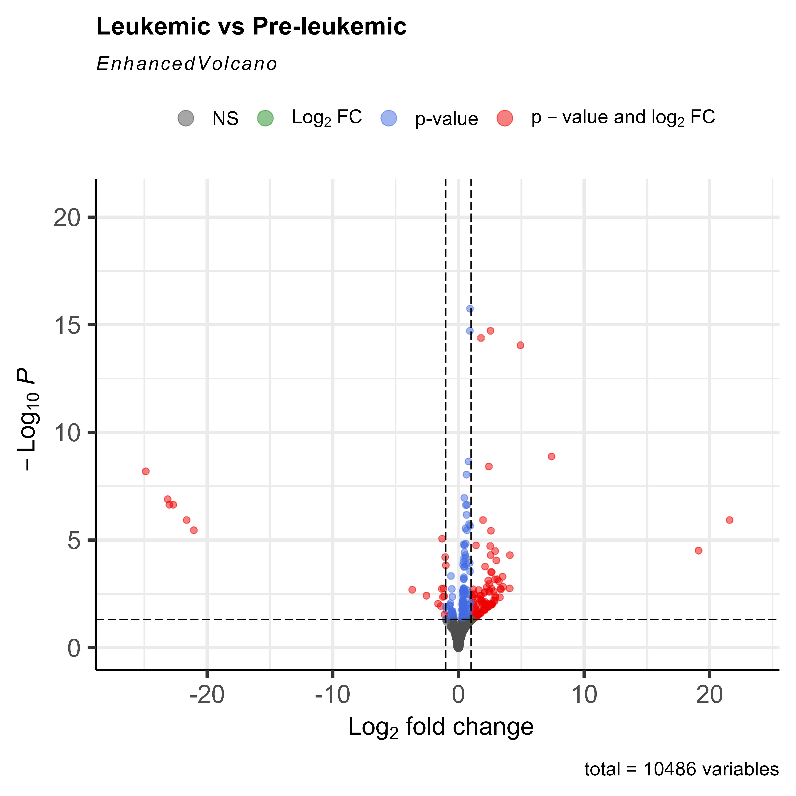
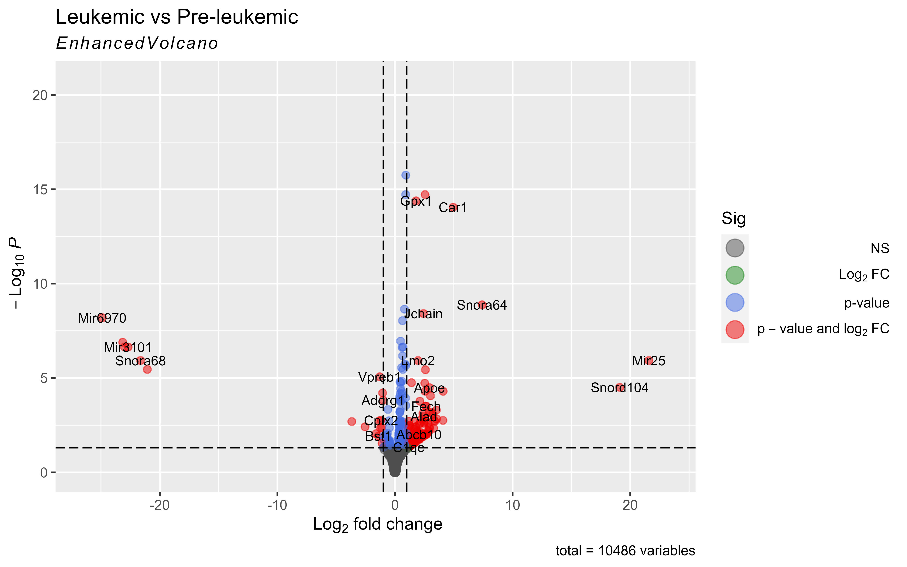
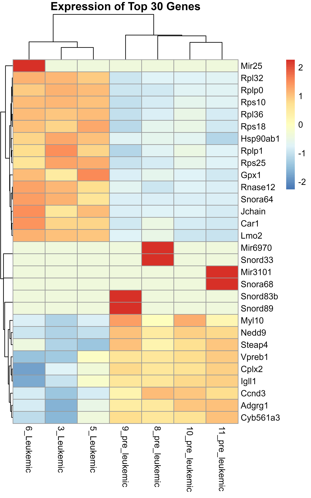
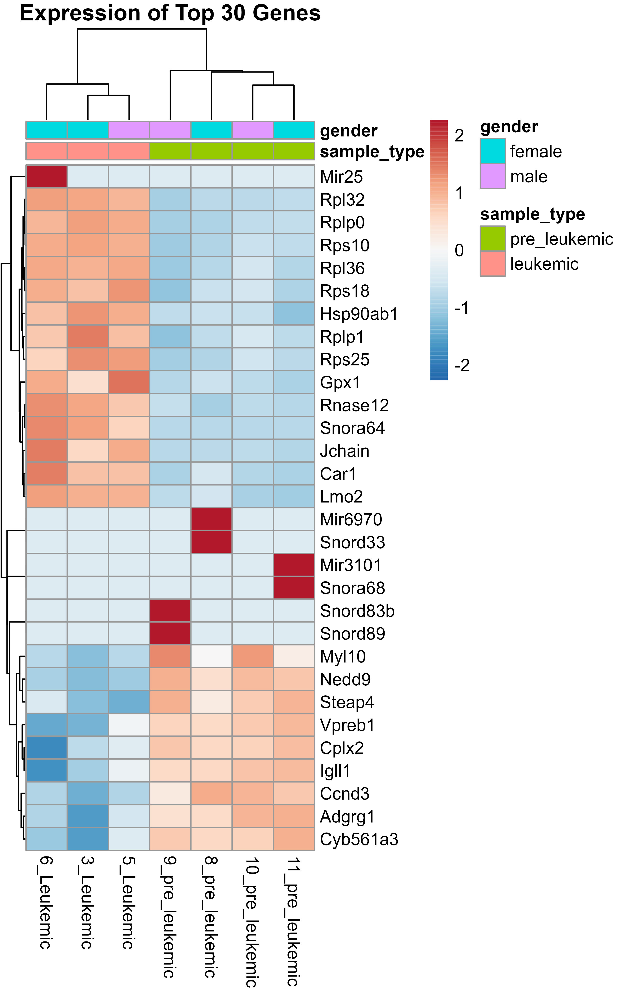
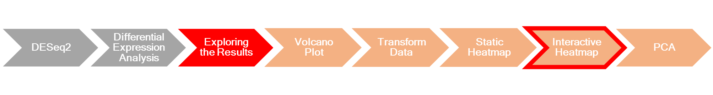
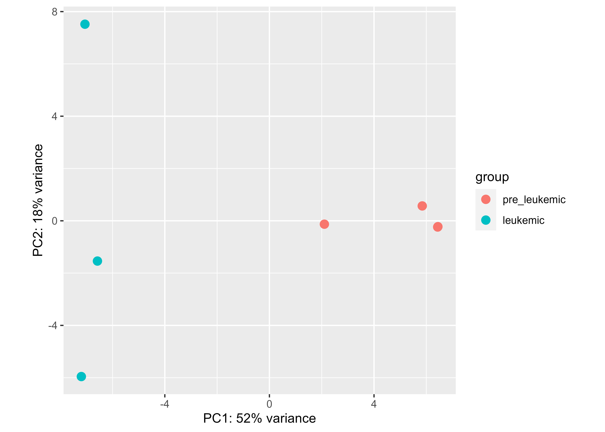
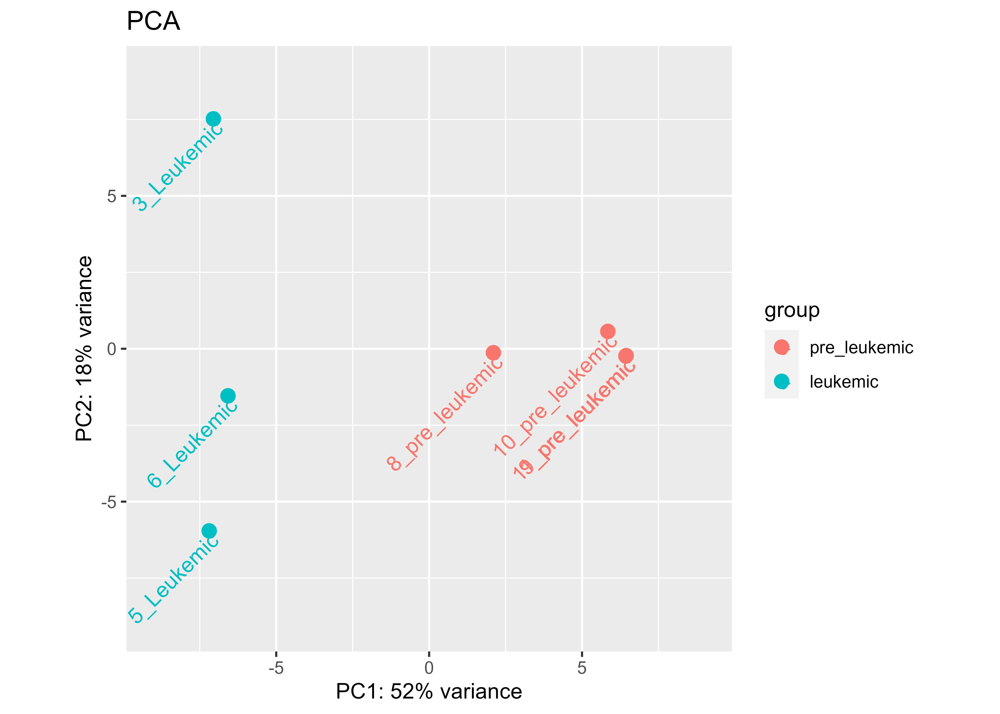

```{r setup, include=FALSE}
knitr::opts_chunk$set(echo = TRUE, include = TRUE)
```

# Introduction

A basic task in analysing RNA-seq count data is to detect differentially expressed genes (DEGs). A gene is differentially expressed if the change in the read counts between two experimental conditions is statistically significant. It is possible to perform differential expression analysis with the DESeq2 package. Its differential expression tests are based on a negative binomial generalised linear model.


```{r, echo=FALSE}
# loading packages
library(tidyverse)
library(DESeq2)
library(EnhancedVolcano)
library(ggrepel)  
library(pheatmap)
library(RColorBrewer)
library(d3heatmap)
library(htmlwidgets)
```

# DESeq2

## Importing Data


The first step is importing data. An RNA-seq count data should be a non-normalised sequence read counts at either the gene or transcript level presented as a table. The rows are the detected genes, and the columns are the number of sequence fragments assigned to each gene for each sample.

```{r}
count_data <- read_delim(file = "data/count_data.txt") # import count data
count_data <- count_data[, -6]
colnames(count_data)[3:9] <- gsub("_FPKM", "", colnames(count_data)[3:9])
colnames(count_data)[3:9] <- gsub("-", "_", colnames(count_data)[3:9])
```

## Make a DESeqDataSet Object


The next step is to create an object of class DESeqDataSet, which will store the counts and intermediate calculations we need for the differential expression analysis. We use `DESeqDataSetFromMatrix(couvst_dfata, colData, design`) for this aim. The first argument is the coun_data. The input should be a matrix, including integer values. Let's take a look at our count data.

```{r}
str(count_data)
```

The first two columns are characters. Other columns are numeric. And it is a data frame. So, we need to convert it to a matrix. But we have mentioned in the previous session that the data type of matrix values should be the same. We need to convert them to integer values.


First, we remove character columns and then we round the numeric values.

```{r}
# adding gene names as rownames
count_data <- tibble::column_to_rownames(count_data, var = "tracking_id")
head(count_data)
# removing the character column
count_data <- count_data[, -1]
# convert the count_data to a matrix
count_data_mat <- as.matrix(count_data)
# round the values to get rid of the decimal part
count_data_rounded <- round(count_data_mat, digits = 0)
head(count_data_rounded)
```


The second argument is colData. A colData is a data frame containing metadata about each sample. Each column should contain categorical values. It means you need to convert them to factor. The priority of the levels of factor variable is important. Here, pre_leukemic should be the reference. If we had other samples types like normal, the priority should be this sequence: normal, pre-leukemic, leukemic.

```{r}
# creating colData
colnames(count_data) # check column names
# the first column vector
sample_type <- c(rep("leukemic", 3), rep("pre_leukemic", 4))
sample_type <- factor(sample_type, levels = c("pre_leukemic", "leukemic"))
# the second column vector 
gender <- c(rep(c("female", "male"), times = 3), "female")
gender <- factor(gender, levels = c("female", "male"))
colData <- data.frame(sample_type = sample_type,
                      gender = gender,
                      row.names = colnames(count_data))
colData
```


The third argument is design. The DESeqDataSet object store the design formula used to estimate dispersion and log2 fold changes used within the model. Specifying the formula should take the form of a "\~" followed by "+" separating factors.

```{r}
dds <- DESeqDataSetFromMatrix(countData = count_data_rounded,
                              colData = colData,
                              design = ~ sample_type + gender)
# View(dds)

```

You can see that dds stores the count data in assays, the design formula in the design, and the colData in the colData. It is impossible to access the count data directly from a DESeqDataSet object. We need to use `assay()`.

```{r}
head(assay(dds))
```

# Differential Expression Analysis


## Pre-filtering


Genes with very low counts don't lead to reliable differential expression results. We need to do some light pre-filtering. This will reduce the size of the DEseq2DataSet object and speed up the algorithm's runtime.

Here we are filtering the genes with a sum total of 10 reads on all samples.

```{r}
nrow(dds)
dds <- dds[rowSums(assay(dds)) > 10, ]
nrow(dds)
```

## The DESeq()


We use `DESeq()` to perform differential expression analysis. It performs some steps, including an outlier removal procedure. This function performs a default analysis through these below steps:

1.  estimation of size factors
2.  estimation of dispersion
3.  Negative Binomial GLM fitting and Wald statistics

```{r}
dds <- DESeq(object = dds)
dds
```

## Shrinkage the Results


The estimates of differences between sample groups calculated by `DESeq()` are not corrected for expression level. When counts are small, it leads to large differences between sample groups. We can fix this by applying a "shrinkage" procedure.

For this aim, we use `lfcShrink()`, but first we need to know the name and/or the position of the "coefficient"[\^1](Coefficient%20is%20the%20number%20in%20front%20of%20a%20variable%20or%20term.%20For%20example,%20in%20%606a%20+%201b%20+%202xy%60%206,%201,%202%20are%20the%20coefficients.) that is calculated by `DESeq()`. We can use `resultsNames()`. The `resultsNames()` returns the names of the model's estimated effects (coefficients).

```{r}
resultsNames(dds)
```

We are interested in comparing pre-leukemic and leukemic samples. It is the second element.

```{r}
shrunken_res <- lfcShrink(dds = dds,
                          # the coefficient we want to reestimate
                          coef = 2, 
                          # We will use `ashr` for estimation
                          type = "ashr")
class(shrunken_res)
head(shrunken_res)
```

Here we describe what each column means:

-   baseMean: The average of the normalised count values, divided by size factors, taken over all samples.

-   log2FoldChange: This value indicates how much the gene or transcript's expression seems to have changed between the comparison and control groups. This value is reported on a logarithmic scale to base 2.

-   lfcSE: Gives the standard error of the log2FoldChange.

-   pvalue: P-value of the test for the gene or transcript.

-   padj: Adjusted P-value for multiple testing for the gene or transcript.

The `summary()` helps us to see the results briefly. You can set the `alpha` argument to 0.05. This is the value of the adjusted p-value.

```{r}
summary(shrunken_res, alpha = 0.05)
```

### Missing P-values

Let's check if there is any missing adjusted p-value.

```{r}
shrunken_res[is.na(shrunken_res$padj), ]
```

Why do we have genes with no adjusted p-value?

Adjusted p-values can be set to NA values if all samples have zero counts within a row, if a row contains a sample with an extreme count outlier, or if a row is filtered because it has a low mean normalised count.

## Significant Genes


The genes with adjusted p-value \< 0.05 are statistically significant. We are going to select them.

```{r}
shrunk_res_sig <- subset(shrunken_res, shrunken_res$padj <= 0.05)
```

# Exploring the Results


## Volcano Plot


```{r, fig.show='hide', include=TRUE}
p <- EnhancedVolcano(shrunken_res,
                lab = NA,
                x = 'log2FoldChange', y = 'padj',
                FCcutoff = 1, pCutoff = 0.05,
                title = 'Leukemic vs Pre-leukemic',
                legendPosition = "top")
ggsave(filename = "plots/not_labeled_volcano.jpg",
       plot = p,
       dpi = 600,
       units = "in",
       height = 8, 
       width = 8)
```



We can name the genes and add a theme layer to the plot.

```{r, fig.show='hide', include=TRUE}
p <- EnhancedVolcano(shrunken_res,
                lab = rownames(shrunken_res),
                labSize = 3,
                x = 'log2FoldChange', y = 'padj',
                FCcutoff = 1, pCutoff = 0.05,
                title = 'Leukemic vs Pre-leukemic') +
  theme_get()

ggsave(filename = "plots/labeled_volcano.jpg",
       plot = p,
       dpi = 600,
       units = "in",
       height = 5, 
       width = 8)

```



## Heatmap


Before visualising count data, we need to transform it. The variance stabilising transformation or VST is the most accurate and fastest way.

```{r}
vst_obj <- vst(dds, blind = FALSE)
vst_df <- as.data.frame(assay(vst_obj))

```

### Static


We will use `pheatmap() from the pheatmap package` to plot the static heatmap. We will visualise the top 30 genes based on the adjusted p-value.

```{r, fig.show='hide', include=TRUE}
# sort shrunken_res by adjusted p-value ascending
shrunken_res <- shrunken_res[order(shrunken_res$padj),]

# select the top 15 up-regulated
top_15_up <- subset(shrunken_res, shrunken_res$padj <= 0.05 & shrunken_res$log2FoldChange > 0)
top_15_up <- top_15_up[1:15, ]
# select the top 15 down-regulated
top_15_down <- subset(shrunken_res, shrunken_res$padj <= 0.05 & shrunken_res$log2FoldChange < 0)
top_15_down <- top_15_down[1:15, ]

# bind them by row

top_30 <- rbind(top_15_up, top_15_down)

# select top 30 from vst_df
top_30 <- subset(vst_df, rownames(vst_df) %in% rownames(top_30))

p <- pheatmap(top_30,
         scale = "row",
         cluster_cols=TRUE, cluster_rows = TRUE, treeheight_row = 10,
         show_rownames = TRUE,
         main = "Expression of Top 30 Genes")

# ggsave helps us to save our plots in jpg, pdf, png, and other types of images format
ggsave(filename = "plots/static_heatmap.jpg",
       plot = p,
       dpi = 600,
       units = "in",
       height = 8, 
       width = 5)
```



Let's change the colour of the heatmap. Here are some of the colour pallets in the RColorBrewer package.

```{r}
display.brewer.all(colorblindFriendly = TRUE)
# We use RdBu
col_pal <- colorRampPalette(rev(brewer.pal(9, "RdBu")))(200)
# see the result
plot(1:length(col_pal), 1:length(col_pal), col = col_pal, cex = 5, pch=19)
```

We selected the new colour for the plot. Let's add an annotation bar for the samples.

```{r, fig.show='hide', include=TRUE}
p <- pheatmap(top_30,
              col=col_pal, 
              scale = "row",
              cluster_cols=TRUE, cluster_rows = TRUE, treeheight_row = 10,
              show_rownames = TRUE,
              annotation_col = colData,  annotation_names_col = TRUE,
              main = "Expression of Top 30 Genes")

ggsave(filename = "plots/static_annotated_heatmap.jpg",
       plot = p,
       dpi = 600,
       units = "in",
       height = 8, 
       width = 5)
```



### Interactive



To plot the interactive heatmap, we use `d3heatmap()` from the d3heatmap package. First, we need to cluster the rows and columns.

```{r}
# clustering
clustRows <- hclust(as.dist(1-cor(t(top_30), method="pearson")), method="single") 
clustColumns <- hclust(as.dist(1-cor(top_30, method="pearson")), method="single")
plot(as.dendrogram(clustColumns))
module.assign <- cutree(clustRows, k = 10)

# plotting

p <- d3heatmap(top_30,
               colors = col_pal,
               Rowv=as.dendrogram(clustRows),
               Colv = as.dendrogram(clustColumns),
               scale='row')
# sevewidget() from htmlwidgets helps us to save HTML files
htmlwidgets::saveWidget(p, 
             file= "plots/interactive_heatmap.html")
p
```

## Principal Component Analysis (PCA)


PCA is an unsupervised method, similar to clustering, to find patterns. It simplifies the complexity of high-dimensional data. You can perform PCA with `prcomp()`.

```{r, include = TRUE, fig.show='hide'}
# we perform PCA based on all of the genes
# Use plotPCA, but return the data for custom plotting

p <- plotPCA(vst_obj,
             ntop = nrow(vst_df), 
             intgroup = "sample_type")
ggsave(filename = "plots/pca_not_labeled.jpg",
       plot = p,
       dpi = 600)
```



Let's add labels on the points and title.

```{r, fig.show='hide', include=TRUE}
p <- plotPCA(vst_obj,
             ntop = nrow(vst_df),
             intgroup = "sample_type") +
  geom_text(aes(label = colnames(vst_obj)),
            hjust = "right",vjust = "right", angle = 45) +
  labs(title = "PCA") +
  xlim(-9, 9) + ylim(-9, 9) # it is important to see pca plots in a square panel

ggsave(filename = "plots/pca_labeled.jpg",
       plot = p,
       dpi = 600)
  
```



# Acknowledgement

I would like to thank my supervisor Dr Gregor Reid, Dr Ali Farrokhi, and Tanmaya Atre, for their support and guidance. Also, I would like to thank Reid's lab members and all of the people who helped me to get through my project.

# Resources

1.  <https://genviz.org/module-04-expression/0004/02/01/DifferentialExpression/>

2.  <https://bioconductor.org/packages/devel/bioc/vignettes/DESeq2/inst/doc/DESeq2.html#theory>

3.  <https://htmlpreview.github.io/?https://github.com/AlexsLemonade/training-modules/blob/2021-september/RNA-seq/06-openpbta_heatmap.nb.html>
