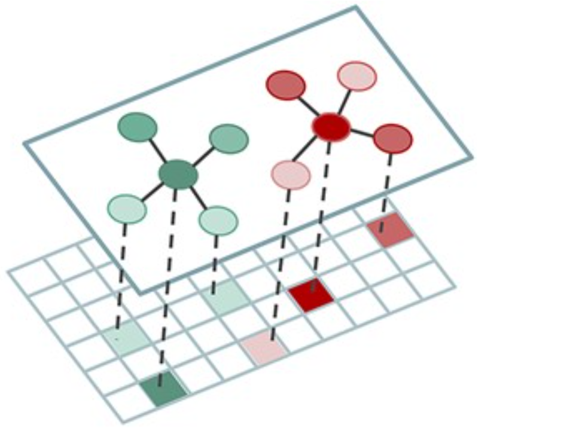
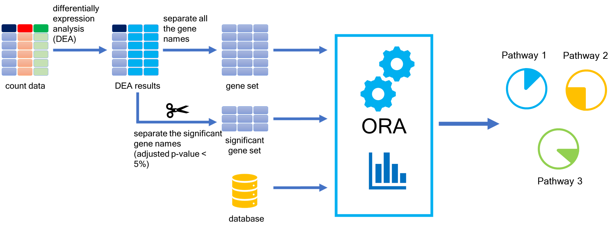
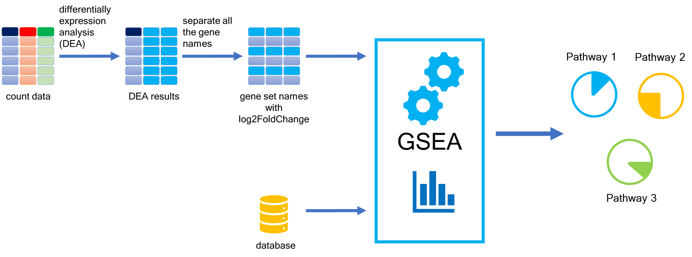
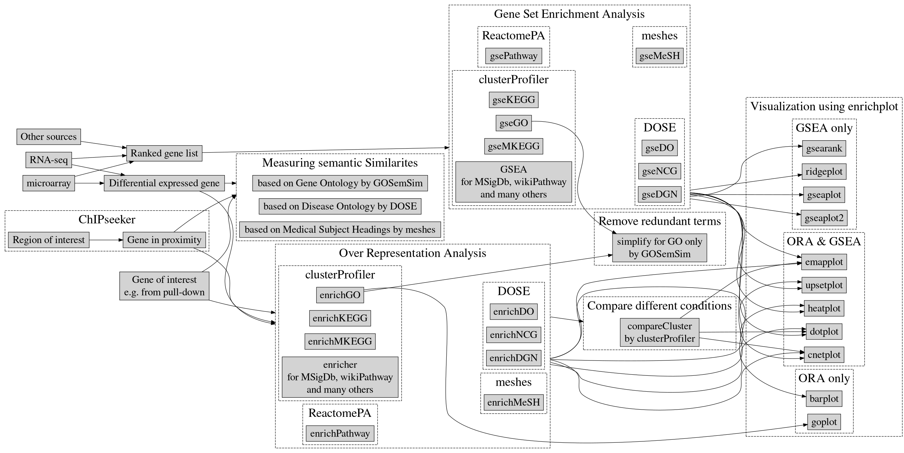
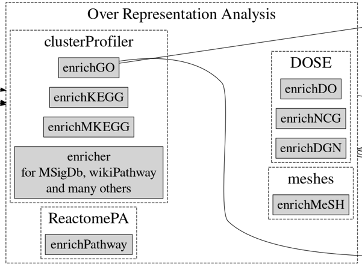
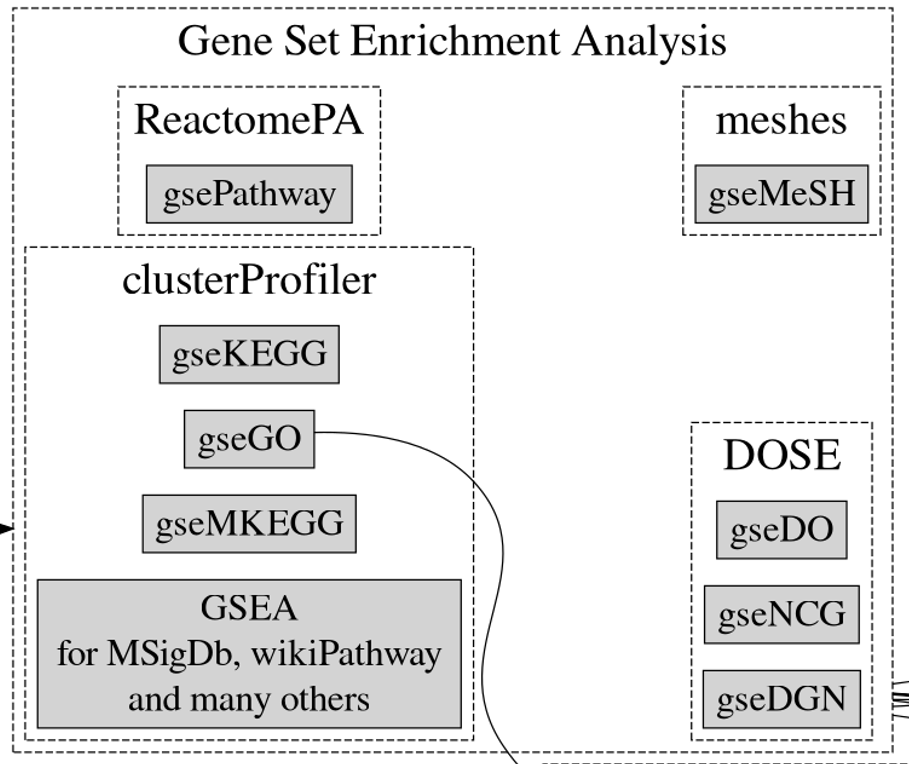
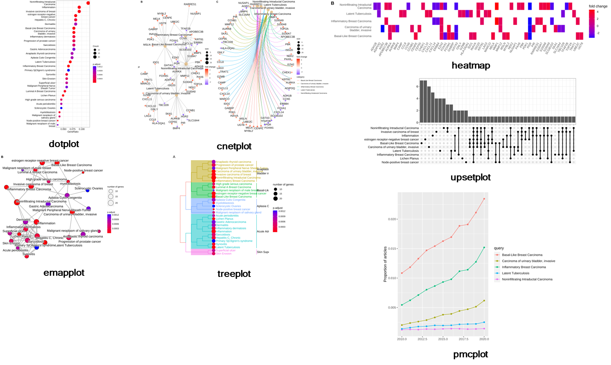

```{r setup, include=FALSE}
knitr::opts_chunk$set(echo = TRUE, include = TRUE)
```

# Introduction

# Pathway Analysis (PA)

[](https://academic.oup.com/bib/article/23/3/bbac143/6572658)

A biological pathway is a series of interactions between molecules of a cell or organisms that leads to a change or phenomena.[@pathway_intro] Pathway analysis (PA), is a set of widely used tools to give meaning to high-throughput -omics data.
The methodology of PA is formed from gathering the knowledge of biology, coupled with statistical testing and other algorithms.
However, despite their wide employment, PA overall background may not be fully understood.[@garcia2015pathway] More than 70 pathway analysis methods have been designed.
A real challenge in PA the the annotation of the pathways.
The limitations in the PA methods cause some bias.
Without a deep knowledge of phenomena, it is impossible to judge that if the connections between your phenomena and pathways are really meaningful or not.
Some methods work well for certain diseases and for some don't.[@nguyen2019identifying] Pathway information is stored in a large number of databases.[@pathway_intro] Databases contain different representations of the same biological pathway.
However, using different databases leads to different enrichment results.
Which means with a method, a pathway can be significant with database 1 but not significant with database 2.[@mubeen2019impact]

# Influencing Factors on the PA

![[@mubeen2022influence]](images/paste-DAB9828D.png)

# PA Methods

PA methods can be categorized into three generations:

1.  Over-representation Analysis (ORA)

2.  Functional Class Scoring (FCS)

3.  Pathway Topology Based (PT) [@mubeen2022influence]

Each of these are going to decrease the limitations and also, adding more complexity.[@khatri2012ten]

## Over-representation Analysis (ORA)

ORA is a method identifying gene sets of a pathway that share a larger number of genes in common with a list of differentially expressed genes (DEGs).
[@mubeen2022influence]



### Limitations

1.  ORA treats each gene, equally.

2.  ORA uses only significant genes and discard others.

3.  ORA assumes that each gene is independent of the other genes.

4.  ORA assumes that each pathway is independent of other pathways.
    [@khatri2012ten]

## Functional Class Scoring (FCS) - Gene Set Enrichment Analysis (GSEA)

FCS assumes that although large changes in individual genes can affect the pathways, weaker but coordinated changes in sets of genes can affect the pathways.
[@khatri2012ten] FCS assigns differential expression score to each gene and rank them by their score.
Then it determines gene sets that are significant.
[@mubeen2022influence] Gene Set Enrichment Analysis (GSEA) is one of the FCS methods.



### Limitations

1.  GSEA analyzes each pathway independently.

2.  GSEA only uses the changes in the gene expression to rank genes in a given pathway and discard the changes for other analysis.
    [@khatri2012ten]

# PA Databases

Gene Ontology (GO) and Kyoto Encyclopedia of Genes and Genomes (KEGG) are one the most important databases.
But other databases like Disease Ontology (DO), WikiPathways, and Reactome are important.
KEGG, WikiPathways, and Reactome are highly cited in the studies and they are open-source.
[@mubeen2019impact]

## GO

{width="576"}

GO consists a set of terms with their relation.
The structure of GO can be described in terms of a graph.
GO terms cover cellular components, molecular functions, and biological processes.
[@GO]

# The clusterProfiler Package



The clusterProfiler package helps us to automates the the enrichment analysis and importing the useful databases.
Also it is combined with visualization packages.
It support three spieces, including humans, mice, and yeast.
[\@yu2012clusterprofiler]

For the workflow and information, we are using the developer's manual.
You can find it [here.](%5Bhttps://yulab-smu.top/biomedical-knowledge-mining-book/index.html)](<https://yulab-smu.top/biomedical-knowledge-mining-book/index.html>))

# Performing Analysis

```{r}
library(AnnotationDbi)
library(org.Mm.eg.db) #org.Hs.eg.db for human
library(tidyverse)
library(clusterProfiler)
library(enrichplot)
library(europepmc)
library(ggridges)
```

## Steps Before Analyzing

### Import DEA Results

```{r}
results_df <- read_csv("data/results.csv")
results_df <- as.data.frame(results_df)
```

### Convert Gene Symbol to Entrez ID

For some reason, the analysis functions work better with Entrez ID. So, we need to convert gene symbols.

```{r}
# creating a named vector. The elements are ENTREZID, and the names are SYMBOL
symbols_vector <- mapIds(x = org.Mm.eg.db,
                         keys = results_df$gene_symbol,
                         keytype = "SYMBOL", # keytypes(org.Mm.eg.db)
                         column = "ENTREZID",
                         multiVals = "first")
symbols_vector

# make a data frame from the named vector
symbols_df <- data.frame(
  gene_symbol = names(symbols_vector), # names() extracts the name of the vector's elements
  entrez_id  = symbols_vector)

symbols_df

# find common rows between symbols_df and based on gene_symbol column
results_df <- dplyr::inner_join(symbols_df, results_df,
                      by = "gene_symbol")
results_df

# check if there is any NA row
results_df[is.na(results_df$entrez_id),]

# drop rows with NA value
results_df <- na.omit(results_df)
```

## ORA



### Separate Significant Genes

```{r}
# subset significant genes from results
sig_genes_df <- subset(results_df, results_df$padj <= 0.05)

# create a vector from entrez_id
sig_genes_vec <- sig_genes_df$entrez_id
head(sig_genes_vec)

```

### Separate Up- and Down-regulated Genes

```{r}
# subset up-regulated genes from significants
up_genes_vec <- subset(sig_genes_df$entrez_id, sig_genes_df$log2FoldChange > 0 )
head(up_genes_vec)

# subset down-regulated genes from significants
down_genes_vec <- subset(sig_genes_df$entrez_id, sig_genes_df$log2FoldChange < 0 )
head(down_genes_vec)
```

### Run enrichGO() for Each Gene Set

```{r}
?enrichGO # see the documentation
down_ora_GO_BP <- enrichGO(down_genes_vec,
                           OrgDb = org.Mm.eg.db,
                           ont = "BP",
                           universe = results_df$entrez_id,
                           keyType = "ENTREZID",
                           readable = TRUE)
# you have to simplify GO terms. It is important.
down_ora_GO_BP <- clusterProfiler::simplify(down_ora_GO_BP, cutoff=0.7, by="p.adjust", select_fun=min)

down_ora_GO_BP


```
```{r}
up_ora_GO_BP <- enrichGO(up_genes_vec,
                           OrgDb = org.Mm.eg.db,
                           ont = "BP",
                           universe = results_df$entrez_id,
                           keyType = "ENTREZID",
                           readable = TRUE)
# you have to simplify GO terms. It is important.
up_ora_GO_BP <- clusterProfiler::simplify(up_ora_GO_BP, cutoff=0.7, by="p.adjust", select_fun=min)

```
### Run compareCluster()

If you want to perform analysis for more than a group of data, you can use compareCluster().

```{r}
# make a list from entrez ids of up- and down-regulated genes
gene_clusters <- list(up_regulated = up_genes_vec, down_regulated = down_genes_vec)

?compareCluster # see the documentation
clustered_ora_GO_BP <-  compareCluster(gene_clusters,
                                       fun= enrichGO,
                                       OrgDb = org.Mm.eg.db,
                                       ont = "BP",
                                       universe = results_df$entrez_id,
                                       keyType = "ENTREZID",
                                       readable = TRUE)

clustered_ora_GO_BP <- clusterProfiler::simplify(clustered_ora_GO_BP, cutoff=0.7, by="p.adjust", select_fun=min) # simplify the GO terms

clustered_ora_GO_BP
```

### Save Output

```{r}

res <- as.data.frame(down_ora_GO_BP@result)
res

# I want to save my output as a csv. So, I want to make sure there is no comma in my Description column
res$Description <- gsub(",","",res$Description)

# write output
write_csv(x = res,
          file = "results/down_ora_GO_BP.csv",
          quote = "none")

res <- as.data.frame(up_ora_GO_BP@result)
res

# I want to save my output as a csv. So, I want to make sure there is no comma in my Description column
res$Description <- gsub(",","",res$Description)

# write output
write_csv(x = res,
          file = "results/up_ora_GO_BP.csv",
          quote = "none")

res <- as.data.frame(clustered_ora_GO_BP@compareClusterResult)
res

# I want to save my output as a csv. So, I want to make sure there is no comma in my Description column
res$Description <- gsub(",","",res$Description)

# write output
write_csv(x = res,
          file = "results/clustered_ora_GO_BP.csv",
          quote = "none")

```

## GSEA



### Create a Named Ordered Gene Set Vector

```{r}
# create a vector of log2FoldChanges
all_genes_lfc <- results_df$log2FoldChange

# name the vector with entrez ids
names(all_genes_lfc) <- results_df$entrez_id

# sort the vector descending 
all_genes_lfc <- sort(all_genes_lfc, decreasing = TRUE)

# do it for up- and down-regulated genes too. Here I am selecting them from the all_genes_lfc

up_genes_lfc <- all_genes_lfc[all_genes_lfc > 0]
down_genes_lfc <- all_genes_lfc[all_genes_lfc < 0]
```

### Run gseGO() for All Gene Set

```{r}
?gseGO # see the documentation

set.seed(123) # set a seed to make your ourputs reproducible 
up_gsea_GO_BP <- gseGO(geneList = up_genes_lfc,
                      OrgDb = org.Mm.eg.db,
                      ont = "BP",
                      seed = TRUE,
                      nPermSimple = 10000)
set.seed(Sys.time())

up_gsea_GO_BP <- clusterProfiler::simplify(up_gsea_GO_BP, cutoff=0.7, by="p.adjust", select_fun=min) # simplify it because you are using GO terms

up_gsea_GO_BP <- setReadable(up_gsea_GO_BP, OrgDb = org.Mm.eg.db, keyType="ENTREZID") # set it readable. It will convert entrez ids to gene symbols


set.seed(123) # set a seed to make your ourputs reproducible 
down_gsea_GO_BP <- gseGO(geneList = down_genes_lfc,
                      OrgDb = org.Mm.eg.db,
                      ont = "BP",
                      seed = TRUE,
                      nPermSimple = 10000)
set.seed(Sys.time())

down_gsea_GO_BP <- clusterProfiler::simplify(down_gsea_GO_BP, cutoff=0.7, by="p.adjust", select_fun=min) # simplify it because you are using GO terms

down_gsea_GO_BP <- setReadable(down_gsea_GO_BP, OrgDb = org.Mm.eg.db, keyType="ENTREZID") # set it readable. It will convert entrez ids to gene symbols
```

### Save Output

```{r}
res <- as.data.frame(up_gsea_GO_BP@result)
res

# I want to save my output as a csv. So, I want to make sure there is no comma in my Description column
res$Description <- gsub(",","",res$Description)
res$leading_edge <- gsub(",","",res$leading_edge)

# write output
write_csv(x = res,
          file = "results/up_gsea_GO_BP.csv",
          quote = "none")

res <- as.data.frame(down_gsea_GO_BP@result)
res

# I want to save my output as a csv. So, I want to make sure there is no comma in my Description column
res$Description <- gsub(",","",res$Description)
res$leading_edge <- gsub(",","",res$leading_edge)

# write output
write_csv(x = res,
          file = "results/down_gsea_GO_BP.csv",
          quote = "none")
```

# Visualization

## ORA and GSEA



### dotplot

Visualize the enriched terms.

```{r}
?dotplot

dotplot(down_ora_GO_BP, 
        showCategory = 10) + # first 10 terms
  ggtitle("ORA down-regulated gene set result")

dotplot(clustered_ora_GO_BP,
        showCategory = 10) +
  ggtitle("ORA clustered gene set result")

dotplot(clustered_ora_GO_BP,
        showCategory = 10,
        label_format = 100) +
  ggtitle("ORA clustered gene set result")
```

### Gene-Concept Network

cnetplot() depicts the linkages of genes and biological concepts (*e.g.* GO terms or KEGG pathways) as a network.

```{r}
?cnetplot
```

```{r}
# ora down regulateg genes 
enrichplot::cnetplot(down_ora_GO_BP, 
                     categorySize="p.value", 
                     showCategory = 5,
                     foldChange = all_genes_lfc, 
                     layout = "kk",
                     node_label = "all") +
    ggtitle(label = "cnet for ORA down-regulated gene set")
```

```{r}
# adding colors to edges
enrichplot::cnetplot(down_ora_GO_BP, 
                     categorySize="p.value", 
                     showCategory = 5,
                     foldChange = all_genes_lfc, 
                     layout = "kk",
                     node_label = "all",
                     colorEdge = TRUE) +
    ggtitle(label = "cnet for ORA down-regulated gene set")
```

```{r}
# ora clustered genes
enrichplot::cnetplot(clustered_ora_GO_BP, 
                     categorySize="p.value", 
                     showCategory = 5,
                     foldChange = all_genes_lfc, 
                     layout = "kk",
                     node_label = "all") +
    ggtitle(label = "cnet for ORA clustered gene set")
```

### Enrichment Map

Enrichment map organizes enriched terms into a network with edges connecting overlapping gene sets. In this way, mutually overlapping gene sets are tend to cluster together, making it easy to identify functional module.

```{r}
# Get the similarity matrix
clustered_ora_GO_BP_sim <- pairwise_termsim(clustered_ora_GO_BP)
clustered_ora_GO_BP_sim

?emapplot

emapplot(clustered_ora_GO_BP_sim) # ask for down
```

### Heatmap

The heatplot is similar to cnetplot, while displaying the relationships as a heatmap.

```{r}
#up_gsea_GO_BP_sim <- pairwise_termsim(up_gsea_GO_BP)

heatplot(down_ora_GO_BP,
         foldChange = all_genes_lfc)

```

### Pubmed Trend of Enriched Terms
One of the problem of enrichment analysis is to find pathways for further investigation. The pmcplot function is provided to plot the number/proportion of publications trend based on the query result from PubMed Central.

```{r}
terms <- down_ora_GO_BP$Description
p <- pmcplot(terms, 2010:2022)
p
View(p[["data"]])
```

## GSEA

### Ridgeline Plot for Expression Distribution of Gsea Result
The ridgeplot will visualize expression distributions of core enriched genes for GSEA enriched categories. It helps users to interpret up/down-regulated pathways.

```{r}
# up-regulated
rp <- ridgeplot(up_gsea_GO_BP, 
                showCategory = 10)
ggsave(filename = "results/ridgeplot_up.jpeg",
       rp,
       units = "in",
       height = 15,
       dpi = 600)
```


```{r}
# down-regulated
rp <- ridgeplot(down_gsea_GO_BP, 
                showCategory = 57)
ggsave(filename = "results/ridgeplot_down.jpeg",
       rp,
       units = "in",
       height = 5,
       dpi = 600)
```
### Running Score and Preranked List of GSEA Result

Running score and preranked list are traditional methods for visualizing GSEA result.

```{r}
# up-regulted
gseaplot2(up_gsea_GO_BP, geneSetID = 1:3)

# down-regulated
gseaplot2(down_gsea_GO_BP, geneSetID = 1:2)
```

# Acknowledgement

I would like to thank my supervisor Dr Gregor Reid, Dr Ali Farrokhi, and Tanmaya Atre, for their support and guidance. Also, I would like to thank Reid's lab members and all of the people who helped me to get through my project.

And Thank you all for participating in the workshop. 